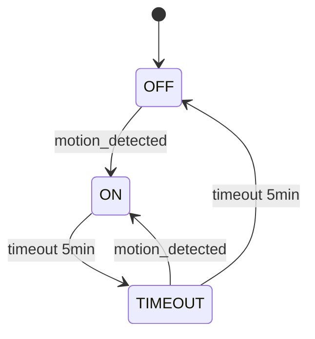

# FSM Visualization (Mermaid/Graphviz)

**Приоритет:** MEDIUM
**Оценка:** 1 день
**Категория:** Quick Wins

## Цель

Визуализация графов состояний FSM для упрощения отладки и понимания сложных сценариев.

## Проблема

Сложные FSM с множеством состояний и переходов трудно понять, читая только YAML.

## Предлагаемое решение

CLI команда для генерации визуализации:

```bash
smart-home export-fsm instances/my_house/manifest.yaml --format mermaid
smart-home export-fsm instances/my_house/manifest.yaml --device light.kitchen --format graphviz
```

## Пример вывода (Mermaid)



## План реализации

1. Создать `core/fsm_visualizer.py`
2. CLI команда `cli/commands/export_fsm.py`
3. Поддержка Mermaid и Graphviz
4. Опциональный экспорт в PNG/SVG
5. Тесты

## Файлы

- `core/fsm_visualizer.py`
- `cli/commands/export_fsm.py`
- `tests/test_fsm_visualizer.py`

## Критерии успеха

- [ ] Mermaid генератор работает
- [ ] Graphviz генератор работает
- [ ] Экспорт в файл и в stdout
- [ ] Покрытие тестами >= 80%
