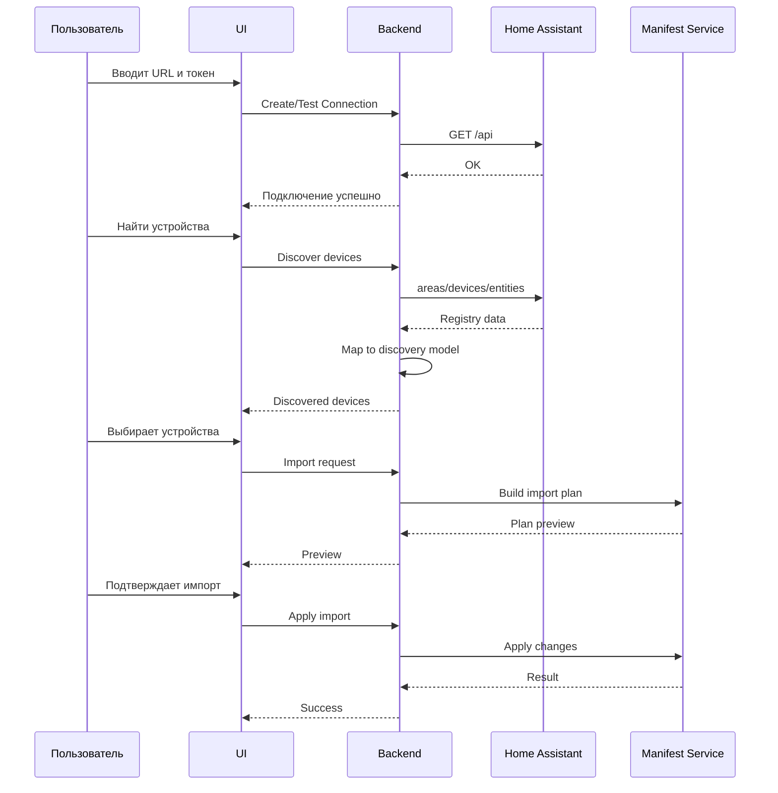

Ниже — готовый проектный документ / spec для фичи **«Добавление устройств из Home Assistant в манифест»**, который можно передать ИИ-агенту для последующей реализации.

> Важно: в текущем чате у меня нет прямого инструмента, чтобы клонировать и прочитать репозиторий `https://github.com/Alkamenos/smart-home-platform`. Поэтому ниже я спроектировал фичу как архитектурно-точную спецификацию, которую ИИ-агент сможет применить к реальному коду: сначала прочитать структуру проекта, найти существующие модули манифеста, интеграций, тестов и адаптировать имена файлов/классов под фактическую кодовую базу.

---

# Спецификация фичи: Добавление устройств из Home Assistant в манифест

## 1. Цель фичи

Позволить пользователю подключить платформу к его экземпляру **Home Assistant**, получить список устройств и сущностей из HA, выбрать нужные устройства и добавить их в **манифест** платформы умного дома.

Фича должна быть:

- безопасной;
- идемпотентной;
- пригодной для будущего коммерческого multi-home / multi-tenant использования;
- удобной для конечного пользователя;
- понятной для AI-агентов, которые будут читать манифест и управлять домом.

---

## 2. Бизнес-ценность

Для конечного пользователя фича выглядит так:

> «Подключил Home Assistant → увидел список устройств → выбрал нужные → они появились в системе и доступны для автоматизаций, голосового управления и AI».

Для проекта это даёт:

1. Быстрый онбординг: не нужно вручную описывать каждое устройство.
2. Единый манифест дома как источник истины для платформы.
3. Основу для коммерческого использования: клиент подключает свой HA и получает управляемый умный дом.
4. Хороший контекст для LLM/AI: устройства, комнаты, возможности, имена, зоны.

---

## 3. Основные пользовательские сценарии

### Сценарий 1: Первый импорт устройств

Пользователь:

1. Открывает раздел «Интеграции» или «Устройства».
2. Нажимает «Добавить Home Assistant».
3. Вводит адрес HA и токен.
4. Проверяет подключение.
5. Запускает обнаружение устройств.
6. Видит список устройств, сгруппированных по комнатам/доменам.
7. Выбирает нужные устройства.
8. Нажимает «Добавить в манифест».
9. Видит результат: сколько устройств добавлено, сколько пропущено, какие были конфликты.

### Сценарий 2: Повторный импорт

Пользователь уже добавлял устройства. При повторном импорте система:

- не создаёт дубли;
- обновляет метаданные существующих устройств;
- показывает статусы: `new`, `updated`, `skipped`, `conflict`, `error`.

### Сценарий 3: Сухой прогон

Пользователь может включить режим `dry-run`:

- система показывает, что будет добавлено/обновлено;
- манифест не изменяется.

### Сценарий 4: Частичный импорт

Пользователь выбирает только:

- свет;
- выключатели;
- климат;
- шторы;
- замки;
- датчики движения/температуры.

и не импортирует технические сущности типа `sensor.cpu_temperature`.

---

## 4. Терминология

### Манифест

Декларативное описание умного дома:

- дом;
- комнаты / зоны;
- устройства;
- возможности устройств;
- интеграции;
- метаданные для AI;
- правила и ограничения.

Пример:

```yaml
version: 1
homes:
  - id: home_main
    name: Мой дом
    integrations:
      - id: ha_main
        type: home_assistant
    areas:
      - id: living_room
        name: Гостиная
    devices:
      - id: device_ha_a1b2c3
        name: Люстра
        area: living_room
        origin: home_assistant
        externalIds:
          homeAssistantDeviceId: a1b2c3
        capabilities:
          - type: light
            entityId: light.living_room_main
            supports:
              onOff: true
              brightness: true
              colorTemperature: true
```

### Home Assistant Device

Устройство из device registry Home Assistant.

Пример:

- люстра;
- датчик движения;
- термостат;
- розетка;
- шлюз;
- замок.

### Home Assistant Entity

Сущность из entity registry / states.

Примеры:

- `light.living_room`;
- `switch.kettle`;
- `sensor.temperature`;
- `binary_sensor.motion`;
- `climate.bedroom`.

---

## 5. Границы фичи

### Входит в фичу

1. Подключение к экземпляру Home Assistant.
2. Проверка соединения.
3. Получение списка:
   - areas;
   - devices;
   - entities.
4. Преобразование данных HA в модель манифеста.
5. Выбор устройств пользователем.
6. Добавление устройств в манифест.
7. Идемпотентный повторный импорт.
8. Отображение результата импорта.
9. Поддержка `dry-run`.
10. Логирование, аудит и обработка ошибок.

### Не входит в первую версию

1. Полная двусторонняя синхронизация.
2. Автоматическое удаление устройств из манифеста при удалении из HA.
3. Импорт автоматизаций.
4. Импорт сцен.
5. Импорт скриптов.
6. Импорт энергопотребления и истории.
7. Редактирование устройств в HA.
8. Управление секретами через UI enterprise-уровня.

Но архитектура должна учитывать будущую синхронизацию.

---

## 6. Целевой UX

### 6.1. Экран подключения к Home Assistant

Поля:

- Название подключения, например `Мой дом`;
- URL Home Assistant, например `http://192.168.1.10:8123`;
- Токен доступа;
- опция «Проверять SSL»;
- опция «Использовать только для чтения».

Кнопки:

- `Проверить подключение`;
- `Сохранить`;
- `Отмена`.

Валидация:

- корректный URL;
- токен не пустой;
- соединение доступно;
- токен валиден;
- пользователь имеет права на чтение.

Ошибки должны быть понятными:

- `Не удалось подключиться к Home Assistant. Проверьте URL и доступность сети.`
- `Токен недействителен или отозван.`
- `Сертификат не может быть проверен. Если вы используете самоподписанный сертификат, разрешите это явно в настройках подключения.`

### 6.2. Экран обнаружения устройств

После подключения пользователь нажимает:

> «Найти устройства»

Система показывает прогресс:

1. Подключение…
2. Получение списка комнат…
3. Получение списка устройств…
4. Получение списка сущностей…
5. Формирование списка устройств…

### 6.3. Экран выбора устройств

Отображается список устройств:

- чекбокс;
- название;
- комната;
- тип;
- производитель;
- модель;
- количество сущностей;
- статус: новое / уже в манифесте / изменено / конфликт.

Фильтры:

- по комнате;
- по типу: свет, выключатель, климат, датчик, замок, шторы и т.д.;
- по статусу: новые / существующие / конфликтные;
- текстовый поиск.

Действия:

- выбрать всё;
- выбрать все в комнате;
- снять всё;
- выбрать только новые;
- выбрать только свет;
- выбрать только датчики.

### 6.4. Предпросмотр импорта

Перед импортом пользователь видит:

```text
Будет добавлено: 12 устройств
Будет обновлено: 3 устройства
Будет пропущено: 5 устройств
Ошибок: 0
```

Для каждого устройства:

- имя;
- действие;
- причина пропуска;
- изменения.

### 6.5. Результат импорта

После импорта:

```text
Импорт завершён успешно.
Добавлено: 12
Обновлено: 3
Пропущено: 5
```

И кнопки:

- `Открыть манифест`;
- `Открыть список устройств`;
- `Импортировать ещё`.

---

## 7. Ключевые архитектурные решения

## ADR-1: Использовать Home Assistant API как адаптер

Мы не работаем с HA напрямую из бизнес-логики.

Создаём отдельный порт:

```ts
interface HomeAssistantGateway {
  ping(): Promise<HAConnectionStatus>;
  getAreas(): Promise<HAArea[]>;
  getDevices(): Promise<HADevice[]>;
  getEntities(): Promise<HAEntity[]>;
}
```

И реализацию:

```ts
class HttpHomeAssistantGateway implements HomeAssistantGateway {
  // REST + WebSocket fallback
}
```

Это позволит:

- подменить HA моками в тестах;
- заменить способ подключения;
- в будущем добавить cloud connector или локальный агент.

---

## ADR-2: Импорт должен быть идемпотентным

Устройство в манифесте должно иметь стабильный внешний идентификатор:

```yaml
externalIds:
  homeAssistantDeviceId: 1a2b3c4d5e6f
```

При повторном импорте:

- если устройство с таким `homeAssistantDeviceId` уже есть — обновляем метаданные;
- если нет — создаём;
- никогда не создаём дубль.

---

## ADR-3: Секреты не должны попадать в манифест

Манифест не должен содержать:

- токен;
- пароль;
- приватные ключи;
- секреты интеграций.

Храним только ссылку на подключение:

```yaml
integrationRef: ha_main
```

Секреты хранятся отдельно:

- в `.env` для локальной разработки;
- в secret manager / vault для продакшена;
- в зашифрованном виде в БД, если подключение создаётся через UI.

---

## ADR-4: Импорт является операцией над манифестом, а не прямой синхронизацией

Первая версия:

- добавляет устройства;
- обновляет метаданные;
- не удаляет устройства автоматически.

Если устройство удалено из HA, оно может быть помечено как:

```yaml
syncStatus: missing_in_source
```

Но удаление из манифеста — только отдельное пользовательское действие или отдельная фича.

---

## ADR-5: Для файловых манифестов использовать генерируемые и пользовательские секции

Если манифест хранится в файлах, важно не затирать ручные правки.

Рекомендуемая схема:

```text
manifest/
  manifest.yaml
  generated/
    home-assistant-main.devices.yaml
  overrides/
    home-assistant-main.devices.yaml
```

Или использовать маркеры:

```yaml
# >>> AUTO-GENERATED: home-assistant ha_main >>>
devices:
  ...
# <<< AUTO-GENERATED: home-assistant ha_main <<<
```

Лучше: отдельные файлы.

Тогда:

- импорт пишет в `generated/`;
- пользовательские переопределения лежат в `overrides/`;
- финальный манифест собирается мержем.

---

## 8. Доменная модель

### 8.1. Подключение к Home Assistant

```ts
interface HomeAssistantConnection {
  id: string;
  name: string;
  baseUrl: string;
  verifySsl: boolean;
  credentialRef: string;
  createdAt: string;
  updatedAt: string;
  status?: "unknown" | "ok" | "error";
}
```

Пример:

```json
{
  "id": "ha_main",
  "name": "Мой дом",
  "baseUrl": "http://192.168.1.10:8123",
  "verifySsl": true,
  "credentialRef": "secret://ha_main_token"
}
```

---

### 8.2. Зоны / комнаты

```ts
interface HAArea {
  area_id: string;
  name: string;
  aliases?: string[];
}
```

Пример:

```json
{
  "area_id": "living_room",
  "name": "Гостиная"
}
```

---

### 8.3. Устройства из HA

```ts
interface HADevice {
  id: string;
  config_entries?: string[];
  identifiers?: Array<[string, string]>;
  manufacturer?: string;
  model?: string;
  name?: string;
  name_by_user?: string;
  area_id?: string | null;
  sw_version?: string;
  hw_version?: string;
  serial_number?: string;
  disabled_by?: string | null;
}
```

---

### 8.4. Сущности из HA

```ts
interface HAEntity {
  entity_id: string;
  unique_id?: string;
  device_id?: string | null;
  platform?: string;
  domain?: string;
  name?: string;
  original_name?: string;
  friendly_name?: string;
  entity_category?: "config" | "diagnostic" | null;
  disabled_by?: string | null;
  hidden_by?: string | null;
  area_id?: string | null;
  device_class?: string | null;
  unit_of_measurement?: string | null;
  supported_features?: number;
  capabilities?: Record<string, unknown>;
}
```

---

### 8.5. Устройство в манифесте

```ts
interface ManifestDevice {
  id: string;
  name: string;
  areaId?: string;
  origin: "home_assistant" | "manual" | "imported";
  sourceConnectionId?: string;
  externalIds: {
    homeAssistantDeviceId?: string;
    homeAssistantIdentifiers?: Array<[string, string]>;
  };
  manufacturer?: string;
  model?: string;
  softwareVersion?: string;
  capabilities: ManifestCapability[];
  ai?: {
    description?: string;
    aliases?: string[];
    visibility?: "primary" | "secondary" | "hidden";
    controllability?: "controllable" | "read_only" | "hidden";
  };
  sync?: {
    lastImportedAt: string;
    status: "ok" | "missing_in_source" | "conflict";
  };
}
```

---

### 8.6. Возможность устройства

```ts
interface ManifestCapability {
  id: string;
  type:
    | "light"
    | "switch"
    | "climate"
    | "cover"
    | "lock"
    | "fan"
    | "sensor"
    | "binary_sensor"
    | "media_player"
    | "vacuum"
    | "button"
    | "scene"
    | "generic";
  entityIds: string[];
  homeAssistantDomain?: string;
  deviceClass?: string;
  supports?: Record<string, boolean | string | number>;
  metadata?: Record<string, unknown>;
}
```

---

## 9. Маппинг Home Assistant → манифест

### 9.1. Комнаты

Из HA:

```json
{
  "area_id": "living_room",
  "name": "Гостиная"
}
```

В манифест:

```yaml
areas:
  - id: living_room
    name: Гостиная
    origin: home_assistant
    externalIds:
      homeAssistantAreaId: living_room
```

Правила:

- если комната с таким `homeAssistantAreaId` уже есть — не дублируем;
- если имя изменилось — обновляем имя, если пользователь не переопределил его вручную;
- если комната без устройств — по умолчанию можно не импортировать, но лучше сохранить для полноты.

---

### 9.2. Устройства

Из HA:

```json
{
  "id": "a1b2c3",
  "name_by_user": "Люстра",
  "name": "IKEA Tradfri bulb",
  "area_id": "living_room",
  "manufacturer": "IKEA",
  "model": "LED1624G9"
}
```

В манифест:

```yaml
devices:
  - id: device_ha_a1b2c3
    name: Люстра
    area: living_room
    origin: home_assistant
    manufacturer: IKEA
    model: LED1624G9
    externalIds:
      homeAssistantDeviceId: a1b2c3
```

Приоритет имени устройства:

1. `name_by_user`;
2. `name`;
3. имя первой основной сущности;
4. сгенерированное имя из `device_id`.

---

### 9.3. Сущности → возможности

| Домен HA | Тип в манифесте | Комментарий |
|---|---|---|
| `light` | `light` | Управление светом |
| `switch` | `switch` | Розетки, реле |
| `climate` | `climate` | Термостаты, обогреватели, кондиционеры |
| `cover` | `cover` | Шторы, ворота, жалюзи |
| `lock` | `lock` | Замки |
| `fan` | `fan` | Вентиляторы |
| `sensor` | `sensor` | Измерительные датчики |
| `binary_sensor` | `binary_sensor` | Бинарные датчики |
| `media_player` | `media_player` | Медиа |
| `vacuum` | `vacuum` | Пылесосы |
| `button` | `button` | Кнопки действий |
| `scene` | `scene` | Сцены, если решим поддерживать |
| остальное | `generic` | Технический режим |

---

### 9.4. Пример маппинга света

Данные из HA:

```json
{
  "entity_id": "light.living_room",
  "domain": "light",
  "friendly_name": "Люстра",
  "supported_features": 44,
  "device_class": "light"
}
```

Манифест:

```yaml
capabilities:
  - id: capability_light_living_room
    type: light
    entityIds:
      - light.living_room
    homeAssistantDomain: light
    supports:
      onOff: true
      brightness: true
      colorTemperature: true
      color: false
      effect: false
```

---

### 9.5. Пример маппинга датчика температуры

Данные из HA:

```json
{
  "entity_id": "sensor.bedroom_temperature",
  "domain": "sensor",
  "device_class": "temperature",
  "unit_of_measurement": "°C"
}
```

Манифест:

```yaml
capabilities:
  - id: capability_sensor_bedroom_temperature
    type: sensor
    entityIds:
      - sensor.bedroom_temperature
    homeAssistantDomain: sensor
    deviceClass: temperature
    supports:
      state: true
      unit: "°C"
```

---

### 9.6. Пример маппинга климата

Данные из HA:

```json
{
  "entity_id": "climate.bedroom",
  "domain": "climate",
  "supported_features": 401,
  "capabilities": {
    "hvac_modes": ["off", "heat", "auto"],
    "preset_modes": ["eco", "comfort"]
  }
}
```

Манифест:

```yaml
capabilities:
  - id: capability_climate_bedroom
    type: climate
    entityIds:
      - climate.bedroom
    homeAssistantDomain: climate
    supports:
      onOff: true
      targetTemperature: true
      hvacModes:
        - "off"
        - heat
        - auto
      presetModes:
        - eco
        - comfort
```

---

## 10. Требования к идентификации и стабильности

### 10.1. Идентификатор устройства

Для устройств из HA используем:

```yaml
externalIds:
  homeAssistantDeviceId: abc123
```

Внутренний `id` устройства должен быть стабильным.

Рекомендуемый формат:

```text
device_ha_{homeAssistantDeviceId}
```

Если нужен глобально уникальный:

```text
urn:smart-home:ha:{connectionId}:{deviceId}
```

Пример:

```text
urn:smart-home:ha:ha_main:a1b2c3
```

---

### 10.2. Идентификатор сущности

Для сущностей используем:

1. `unique_id` из entity registry, если доступен;
2. `entity_id` как fallback;
3. пару `device_id + entity_id` как дополнительный контекст.

Важно:

`entity_id` может изменяться пользователем в HA, поэтому при наличии `unique_id` лучше хранить его.

```yaml
externalIds:
  homeAssistantEntityId: light.living_room
  homeAssistantUniqueId: 8f3b2c1d
```

---

### 10.3. Антидубли

Правила:

1. Не создавать второе устройство, если уже есть `externalIds.homeAssistantDeviceId`.
2. Не создавать дублирующую capability, если уже есть такая же `entityId` или `uniqueId`.
3. При конфликте показывать пользователю статус `conflict`.

---

## 11. Правила фильтрации

По умолчанию импорт должен быть полезен конечному пользователю и не засорять манифест техническими сущностями.

### 11.1. Исключать по умолчанию

- `entity_category: diagnostic`;
- `entity_category: config`;
- disabled entities;
- hidden entities;
- служебные сущности без устройства;
- entities без friendly name, если это не основной домен;
- устройства без пользовательских сущностей.

Примеры технических сущностей:

- `sensor.device_uptime`;
- `sensor.last_boot`;
- `update.core_update`;
- `button.restart`;
- diagnostic-датчики Zigbee;
- конфигурационные сущности.

### 11.2. Включать по умолчанию

- `light`;
- `switch`;
- `climate`;
- `cover`;
- `lock`;
- `fan`;
- `binary_sensor` с device_class:
  - motion;
  - door;
  - window;
  - smoke;
  - gas;
  - moisture;
  - safety;
- `sensor` с device_class:
  - temperature;
  - humidity;
  - illuminance;
  - co2;
  - pm25;
  - pm10;
  - battery;
  - power;
  - energy;
  - voltage;
  - current.

### 11.3. Пользователь может переопределить

Нужны опции:

```text
[x] Показывать технические сущности
[x] Показывать отключённые сущности
[x] Показывать скрытые сущности
[ ] Импортировать устройства без комнаты
[ ] Импортировать сцены
[ ] Импортировать скрипты
```

---

## 12. Процесс импорта

## 12.1. Общая последовательность



---

## 12.2. Этапы

### Этап 1: Проверка подключения

```text
Input:
- baseUrl
- token

Actions:
1. GET /api или /api/config
2. Проверить HTTP status
3. Проверить формат ответа
4. Проверить версию/доступность

Output:
- success
- error
```

### Этап 2: Получение реестров

Источники:

1. Предпочтительно:
   - WebSocket API:
     - `config/area_registry/list`
     - `config/device_registry/list`
     - `config/entity_registry/list`
   - REST fallback:
     - `GET /api/states`

2. Если WebSocket недоступен:
   - использовать `GET /api/states`;
   - извлекать доступные атрибуты;
   - помечать качество данных как пониженное.

### Этап 3: Обогащение

Для каждого устройства:

- найти связанные сущности;
- отфильтровать технические;
- определить тип устройства по основному домену;
- определить возможности;
- определить комнату;
- вычислить имя;
- определить статус конфликта.

### Этап 4: Построение плана импорта

Результат:

```ts
interface ImportPlan {
  connectionId: string;
  dryRun: boolean;
  createdAt: string;
  summary: {
    newDevices: number;
    updatedDevices: number;
    skippedDevices: number;
    conflicts: number;
    errors: number;
  };
  devices: ImportPlanItem[];
  areas: ImportPlanArea[];
}
```

Пример элемента:

```ts
interface ImportPlanItem {
  deviceId: string;
  name: string;
  area?: string;
  action: "create" | "update" | "skip" | "conflict" | "error";
  reason?: string;
  changes?: string[];
  manifestDevice: ManifestDevice;
}
```

### Этап 5: Применение изменений

При применении:

1. Валидируем манифест.
2. Применяем изменения транзакционно.
3. Сохраняем резервную копию, если манифест файловый.
4. Пишем аудит.
5. Возвращаем результат.

---

## 13. Режимы импорта

### 13.1. `create-only`

Добавляет только новые устройства.

Существующие не трогает.

Рекомендуется по умолчанию.

### 13.2. `update-metadata`

Обновляет:

- имя;
- комнату;
- производителя;
- модель;
- список возможностей;
- last import timestamp.

Но не удаляет пользовательские переопределения.

### 13.3. `replace`

Опасный режим.

Полностью заменяет устройство описанием из HA.

Должен требовать явного подтверждения.

### 13.4. `dry-run`

Ничего не меняет, только возвращает план.

---

## 14. Требования к манифесту

## 14.1. Схема

Нужно расширить манифест полями:

```yaml
origin: home_assistant
sourceConnectionId: ha_main
externalIds:
  homeAssistantDeviceId: abc123
sync:
  lastImportedAt: 2026-09-22T12:00:00Z
  status: ok
```

Для возможностей:

```yaml
capabilities:
  - id: capability_light_living_room
    type: light
    entityIds:
      - light.living_room
    homeAssistantDomain: light
    supports:
      onOff: true
      brightness: true
```

---

## 14.2. Совместимость

Если в проекте уже есть устройства без `origin` и `externalIds`:

- считаем их `manual`;
- не трогаем при импорте;
- не удаляем;
- не перезаписываем.

---

## 14.3. Валидация

Манифест после импорта должен проходить проверку:

1. Все устройства имеют уникальный `id`.
2. Все `area` ссылаются на существующие комнаты или явно помечены как неизвестные.
3. Нет дублей `externalIds`.
4. Нет секретов.
5. Нет пустых обязательных полей.
6. Возможности имеют корректный `type`.
7. Для управляемых устройств есть хотя бы одна основная сущность.

---

## 15. Безопасность

### 15.1. Токены

- Токен никогда не сохраняется в манифесте.
- Токен не логируется.
- Токен не возвращается в API.
- В логах и ответах отображается только `credentialRef` или маска.

Пример маски:

```text
token: ****abcd
```

### 15.2. Транспорт

Для продакшена:

- требовать HTTPS;
- для локальной разработки разрешать HTTP только при явном флаге;
- проверять TLS-сертификаты по умолчанию.

### 15.3. Минимальные привилегии

В будущем желательно использовать отдельного пользователя HA с минимальными правами.

Пока используем:

- read-only операции;
- только получение реестров и состояний;
- без вызова сервисов в первой фазе импорта.

### 15.4. Аудит

Каждый импорт должен писать:

```json
{
  "eventType": "manifest.devices.imported",
  "connectionId": "ha_main",
  "userId": "user_1",
  "dryRun": false,
  "summary": {
    "created": 12,
    "updated": 3,
    "skipped": 5,
    "errors": 0
  },
  "timestamp": "2026-09-22T12:00:00Z"
}
```

---

## 16. Ошибки и устойчивость

### 16.1. Ошибки подключения

| Ошибка | Поведение |
|---|---|
| Недостижимый хост | Показать понятную ошибку, предложить проверить сеть |
| Timeout | Повторить с ограниченным числом попыток |
| 401/403 | Токен недействителен или нет прав |
| 404 | Неверный URL или недоступный endpoint |
| TLS error | Предложить проверить сертификат |
| HA version unsupported | Предупредить, но попробовать совместимый режим |

### 16.2. Ошибки данных

| Проблема | Поведение |
|---|---|
| Устройство без сущностей | Пропустить или пометить как `empty` |
| Сущность без устройства | Опционально создать виртуальное устройство |
| Дубли `device_id` | Сообщить о конфликте |
| Неизвестный домен | Импортировать как `generic`, если включено |
| Невалидное имя | Санитизировать, но сохранить оригинал в метаданных |

### 16.3. Частичный успех

Если часть устройств импортирована, а часть нет:

- импорт не должен падать полностью;
- результат должен содержать список ошибок;
- статус: `completed_with_errors`.

---

## 17. Производительность

Ожидаемые требования для первой версии:

- до 1000 устройств без деградации;
- до 5000 сущностей;
- время обнаружения до 30 секунд;
- импорт до 1000 устройств до 30 секунд.

Если данных больше:

- использовать фоновую задачу;
- показывать прогресс;
- возвращать `jobId`;
- опрашивать статус.

---

## 18. Формат результата импорта

API должен возвращать:

```json
{
  "status": "completed",
  "dryRun": false,
  "summary": {
    "created": 12,
    "updated": 3,
    "skipped": 5,
    "conflicts": 1,
    "errors": 0
  },
  "items": [
    {
      "deviceId": "device_ha_a1b2c3",
      "name": "Люстра",
      "action": "created"
    },
    {
      "deviceId": "device_ha_b2c3d4",
      "name": "Датчик температуры",
      "action": "updated",
      "changes": [
        "area",
        "capabilities"
      ]
    },
    {
      "deviceId": "device_ha_c3d4e5",
      "name": "Служебный датчик",
      "action": "skipped",
      "reason": "diagnostic_entity"
    }
  ],
  "errors": []
}
```

---

## 19. CLI / API / UI

Фича должна быть доступна минимум через один интерфейс. Для AI-first лучше сразу проектировать все три уровня.

---

## 19.1. CLI

Пример:

```bash
smart-home manifest import-ha \
  --connection ha_main \
  --url http://192.168.1.10:8123 \
  --token-env HA_TOKEN \
  --include-domains light,switch,climate,cover,lock \
  --exclude-diagnostic \
  --mode create-only \
  --dry-run
```

Опции:

- `--connection` — имя подключения;
- `--url` — адрес HA;
- `--token-env` — переменная окружения с токеном;
- `--include-domains`;
- `--exclude-domains`;
- `--include-hidden`;
- `--include-disabled`;
- `--include-diagnostic`;
- `--mode create-only | update-metadata | replace`;
- `--dry-run`;
- `--output json | table`.

---

## 19.2. REST API

### Проверка подключения

```http
POST /api/home-assistant/connections/test
```

```json
{
  "baseUrl": "http://192.168.1.10:8123",
  "token": "..."
}
```

Ответ:

```json
{
  "status": "ok",
  "version": "2026.9",
  "message": "Connected"
}
```

---

### Обнаружение устройств

```http
POST /api/home-assistant/discover
```

```json
{
  "baseUrl": "http://192.168.1.10:8123",
  "credentialRef": "secret://ha_main_token",
  "filters": {
    "includeDomains": ["light", "switch", "climate"],
    "excludeDiagnostic": true,
    "excludeDisabled": true,
    "excludeHidden": true
  }
}
```

Ответ:

```json
{
  "connectionId": "ha_main",
  "areas": [],
  "devices": [],
  "summary": {
    "totalDevices": 42,
    "selectableDevices": 31,
    "hiddenDevices": 8,
    "diagnosticEntities": 14
  }
}
```

---

### Предпросмотр импорта

```http
POST /api/manifest/import/home-assistant/preview
```

```json
{
  "connectionId": "ha_main",
  "selectedDeviceIds": ["a1b2c3", "b2c3d4"],
  "mode": "create-only",
  "options": {
    "includeDiagnostic": false,
    "includeDisabled": false,
    "includeHidden": false
  }
}
```

---

### Импорт

```http
POST /api/manifest/import/home-assistant
```

```json
{
  "connectionId": "ha_main",
  "selectedDeviceIds": ["a1b2c3", "b2c3d4"],
  "mode": "create-only",
  "dryRun": false,
  "options": {
    "includeDiagnostic": false,
    "includeDisabled": false,
    "includeHidden": false
  }
}
```

---

## 19.3. UI

UI должен быть построен вокруг трёх шагов:

1. Подключение.
2. Выбор устройств.
3. Подтверждение и результат.

Желательно:

- прогресс-бар;
- группировка по комнатам;
- группировка по типам;
- статус существующих устройств;
- поиск;
- массовый выбор;
- понятные ошибки.

---

## 20. AI-first требования

Так как платформа ориентирована на AI, манифест должен быть полезен не только программе, но и языковой модели.

Для каждого устройства желательно добавлять:

```yaml
ai:
  description: "Основной потолочный свет в гостиной"
  aliases:
    - люстра
    - потолочный свет
    - свет в гостиной
  visibility: primary
  controllability: controllable
```

В первой версии можно генерировать простые описания автоматически:

```yaml
ai:
  description: "Устройство из Home Assistant: Люстра в комнате Гостиная"
  aliases:
    - Люстра
    - Гостиная люстра
  visibility: primary
  controllability: controllable
```

Позже можно добавить опциональный LLM-этап:

- предлагать красивые имена;
- предлагать комнаты;
- определять тип устройства;
- добавлять алиасы;
- помечать критичные устройства: замки, датчики дыма, протечки.

Но:

- LLM не должен молча менять манифест;
- все AI-предложения должны быть предпросматриваемыми и подтверждаемыми.

---

## 21. Пользовательские алиасы и семантика

Для AI важно понимать:

- где устройство;
- что оно делает;
- как его можно называть;
- можно ли им управлять;
- является ли оно критичным.

Пример:

```yaml
devices:
  - id: device_ha_a1b2c3
    name: Люстра
    area: living_room
    ai:
      aliases:
        - люстра
        - основной свет
        - свет в гостиной
      intents:
        - turn_on
        - turn_off
        - set_brightness
      controllability: controllable
      safetyLevel: normal
```

Для датчика:

```yaml
devices:
  - id: device_ha_d4e5f6
    name: Датчик движения в коридоре
    area: hallway
    ai:
      aliases:
        - движение в коридоре
        - датчик движения
      intents:
        - read_state
      controllability: read_only
      safetyLevel: normal
```

Для замка:

```yaml
devices:
  - id: device_ha_e5f6g7
    name: Входной замок
    ai:
      aliases:
        - входная дверь
        - замок входной двери
      controllability: controllable_with_confirmation
      safetyLevel: high
```

---

## 22. Требования к тестам

Работаем по TDD.

---

## 22.1. Unit-тесты

### Маппинг устройств

- устройство с `name_by_user` получает пользовательское имя;
- устройство без `name_by_user` получает заводское имя;
- устройство без имени получает имя из первой сущности;
- комната маппится корректно;
- устройство без комнаты попадает в `unassigned` или остаётся без комнаты.

### Маппинг сущностей

- `light` → `light`;
- `switch` → `switch`;
- `sensor.temperature` → sensor with deviceClass temperature;
- `binary_sensor.motion` → binary_sensor with deviceClass motion;
- неизвестный домен → `generic`.

### Фильтрация

- диагностические сущности исключаются по умолчанию;
- конфигурационные сущности исключаются по умолчанию;
- скрытые сущности исключаются по умолчанию;
- отключённые сущности исключаются по умолчанию;
- пользователь может включить их опцией.

### Идемпотентность

- повторный импорт не создаёт дубли;
- существующее устройство обновляется;
- ручные переопределения не затираются;
- конфликт корректно помечается.

### Безопасность

- токен не попадает в логи;
- токен не попадает в манифест;
- токен не возвращается в API.

---

## 22.2. Интеграционные тесты

Нужен мок Home Assistant.

Мок должен отдавать:

- `/api` или `/api/config`;
- список areas;
- список devices;
- список entities;
- ошибки 401, 403, 404, 500;
- таймауты.

Сценарии:

1. Успешное обнаружение.
2. Успешный импорт.
3. Импорт с `dry-run`.
4. Повторный импорт без дублей.
5. Ошибка авторизации.
6. Ошибка сети.
7. Частичный импорт с ошибками.
8. Импорт только выбранных устройств.
9. Импорт устройств без комнаты.
10. Импорт неизвестных доменов.

---

## 22.3. E2E-тесты

Для будущего коммерческого продукта важно проверить пользовательский путь:

1. Открыть страницу интеграций.
2. Добавить Home Assistant.
3. Проверить подключение.
4. Найти устройства.
5. Выбрать свет и датчики.
6. Сделать предпросмотр.
7. Импортировать.
8. Увидеть устройства в манифесте.

---

## 23. План реализации для ИИ-агента

Ниже — пошаговый план.

---

## Шаг 0: Изучить кодовую базу

ИИ должен сначала прочитать:

```text
README.md
package.json / pyproject.toml / Cargo.toml / csproj
src/
app/
lib/
manifest/
schemas/
tests/
e2e/
openapi/
docs/
```

Найти:

1. Где хранится манифест.
2. Какой формат манифеста: YAML, JSON, DB, TS-объекты.
3. Есть ли схема манифеста.
4. Есть ли уже модуль интеграций.
5. Есть ли уже клиент Home Assistant.
6. Как устроены тесты.
7. Какой стиль кода используется.
8. Есть ли логгер, конфиг, ошибки, HTTP-клиент.
9. Есть ли CLI.
10. Есть ли frontend/UI.

---

## Шаг 1: Расширить схему манифеста

Добавить:

- `origin`;
- `sourceConnectionId`;
- `externalIds`;
- `sync`;
- `capabilities`;
- `ai`.

Если схема уже есть — расширить её обратно совместимо.

---

## Шаг 2: Создать порт `HomeAssistantGateway`

Определить интерфейсы:

```ts
HomeAssistantGateway
AreaRepository
DeviceRepository
ManifestRepository
DeviceImportService
```

---

## Шаг 3: Реализовать mock/fake для HA

Для TDD сначала создать фейковые данные:

```ts
const fakeAreas = [...];
const fakeDevices = [...];
const fakeEntities = [...];
```

---

## Шаг 4: Написать тесты на маппинг

До реализации маппера написать тесты:

- `light` → `light`;
- `switch` → `switch`;
- diagnostic → excluded;
- duplicate → updated;
- unknown domain → generic.

---

## Шаг 5: Реализовать маппер

Функции:

```ts
mapAreaToManifest(area: HAArea): ManifestArea;
mapDeviceToManifest(device: HADevice, entities: HAEntity[]): ManifestDevice;
mapEntityToCapability(entity: HAEntity): ManifestCapability | null;
buildImportPlan(discovery: HADiscovery, options: ImportOptions): ImportPlan;
```

---

## Шаг 6: Реализовать сервис импорта

```ts
class DeviceImportService {
  async discover(connection: HomeAssistantConnection): Promise<DiscoveryResult>;
  async preview(request: ImportRequest): Promise<ImportPlan>;
  async import(request: ImportRequest): Promise<ImportResult>;
}
```

---

## Шаг 7: Реализовать запись в манифест

Если манифест файловый:

- читать текущий манифест;
- валидировать;
- применять изменения;
- писать атомарно;
- создавать резервную копию;
- не удалять пользовательские устройства.

Если манифест в БД:

- использовать транзакцию;
- использовать upsert по `externalIds`.

---

## Шаг 8: Добавить API/CLI/UI

В зависимости от стека проекта.

Минимально:

- команда/метод для подключения;
- команда/метод для обнаружения;
- команда/метод для импорта;
- вывод результата.

---

## Шаг 9: Добавить логирование и аудит

Логи:

- `import.started`;
- `import.discovery.completed`;
- `import.preview.completed`;
- `import.completed`;
- `import.failed`.

Метрики:

- `import_count`;
- `import_duration_seconds`;
- `import_devices_created_total`;
- `import_devices_updated_total`;
- `import_errors_total`.

---

## Шаг 10: Обновить документацию

Добавить:

- как подключить HA;
- как получить токен;
- какие устройства поддерживаются;
- что делает импорт;
- как работает повторный импорт;
- как исключить технические сущности.

---

## 24. Контракт данных для импорта

```ts
interface ImportOptions {
  includeDomains?: string[];
  excludeDomains?: string[];
  includeDiagnostic?: boolean;
  includeDisabled?: boolean;
  includeHidden?: boolean;
  includeAreas?: boolean;
  includeEntitiesWithoutDevice?: boolean;
  mode: "create-only" | "update-metadata" | "replace";
  dryRun: boolean;
}
```

```ts
interface ImportRequest {
  connectionId: string;
  selectedDeviceIds?: string[];
  selectedAreaIds?: string[];
  options: ImportOptions;
}
```

```ts
interface ImportResult {
  status: "completed" | "completed_with_errors" | "failed";
  summary: ImportSummary;
  items: ImportResultItem[];
  errors: ImportError[];
}
```

```ts
interface ImportSummary {
  created: number;
  updated: number;
  skipped: number;
  conflicts: number;
  errors: number;
}
```

```ts
interface ImportResultItem {
  deviceId: string;
  name: string;
  action: "created" | "updated" | "skipped" | "conflict" | "error";
  reason?: string;
  changes?: string[];
}
```

---

## 25. Пример JSON Schema для устройства

Упрощённая схема:

```json
{
  "$schema": "http://json-schema.org/draft-07/schema#",
  "title": "ManifestDevice",
  "type": "object",
  "required": ["id", "name", "origin"],
  "properties": {
    "id": {
      "type": "string"
    },
    "name": {
      "type": "string"
    },
    "area": {
      "type": "string"
    },
    "origin": {
      "type": "string",
      "enum": ["home_assistant", "manual", "imported"]
    },
    "sourceConnectionId": {
      "type": "string"
    },
    "externalIds": {
      "type": "object",
      "properties": {
        "homeAssistantDeviceId": {
          "type": "string"
        },
        "homeAssistantIdentifiers": {
          "type": "array",
          "items": {
            "type": "array",
            "items": {
              "type": "string"
            }
          }
        }
      }
    },
    "capabilities": {
      "type": "array",
      "items": {
        "type": "object",
        "required": ["id", "type"],
        "properties": {
          "id": { "type": "string" },
          "type": { "type": "string" },
          "entityIds": {
            "type": "array",
            "items": { "type": "string" }
          },
          "homeAssistantDomain": { "type": "string" },
          "deviceClass": { "type": "string" },
          "supports": { "type": "object" }
        }
      }
    }
  }
}
```

---

## 26. Пример манифеста после импорта

```yaml
version: 1

homes:
  - id: home_main
    name: Мой дом
    integrations:
      - id: ha_main
        type: home_assistant
        name: Home Assistant
        baseUrl: http://192.168.1.10:8123
        credentialRef: secret://ha_main_token

    areas:
      - id: living_room
        name: Гостиная
        origin: home_assistant
        externalIds:
          homeAssistantAreaId: living_room

      - id: bedroom
        name: Спальня
        origin: home_assistant
        externalIds:
          homeAssistantAreaId: bedroom

    devices:
      - id: device_ha_a1b2c3
        name: Люстра
        area: living_room
        origin: home_assistant
        sourceConnectionId: ha_main
        manufacturer: IKEA
        model: LED1624G9
        externalIds:
          homeAssistantDeviceId: a1b2c3
        capabilities:
          - id: capability_light_living_room
            type: light
            entityIds:
              - light.living_room
            homeAssistantDomain: light
            supports:
              onOff: true
              brightness: true
              colorTemperature: true
        ai:
          description: "Основной свет в гостиной"
          aliases:
            - люстра
            - свет в гостиной
            - основной свет
          visibility: primary
          controllability: controllable
        sync:
          lastImportedAt: "2026-09-22T12:00:00Z"
          status: ok

      - id: device_ha_b2c3d4
        name: Датчик температуры
        area: bedroom
        origin: home_assistant
        sourceConnectionId: ha_main
        externalIds:
          homeAssistantDeviceId: b2c3d4
        capabilities:
          - id: capability_sensor_bedroom_temperature
            type: sensor
            entityIds:
              - sensor.bedroom_temperature
            homeAssistantDomain: sensor
            deviceClass: temperature
            supports:
              state: true
              unit: "°C"
        ai:
          description: "Датчик температуры в спальне"
          aliases:
            - температура в спальне
            - датчик температуры спальни
          visibility: primary
          controllability: read_only
        sync:
          lastImportedAt: "2026-09-22T12:00:00Z"
          status: ok
```

---

## 27. Gherkin-сценарии для TDD

```gherkin
Feature: Добавление устройств из Home Assistant в манифест

  Scenario: Успешное подключение к Home Assistant
    Given пользователь указал корректный URL Home Assistant
    And пользователь указал валидный токен
    When пользователь проверяет подключение
    Then система показывает успешное подключение

  Scenario: Обнаружение устройств
    Given подключение к Home Assistant успешно
    When пользователь запускает обнаружение устройств
    Then система показывает список устройств из Home Assistant
    And устройства сгруппированы по комнатам
    And технические сущности скрыты по умолчанию

  Scenario: Добавление новых устройств в манифест
    Given пользователь выбрал несколько новых устройств
    When пользователь подтверждает импорт
    Then выбранные устройства добавляются в манифест
    And манифест остаётся валидным
    And пользователь видит результат импорта

  Scenario: Повторный импорт не создаёт дубли
    Given устройства уже были импортированы из Home Assistant
    When пользователь запускает повторный импорт тех же устройств
    Then дубли устройств не создаются
    And существующие устройства могут быть обновлены

  Scenario: Импорт с сухим прогоном
    Given пользователь выбрал устройства для импорта
    When пользователь запускает импорт в режиме dry-run
    Then система показывает план импорта
    And манифест не изменяется
```

---

## 28. Возможные краевые случаи

### 1. Устройство есть в HA, но у него нет сущностей

Решение:

- показать как `empty`;
- не импортировать по умолчанию;
- дать опцию «Импортировать пустые устройства».

---

### 2. Сущность есть, но устройства нет

Например:

- `template sensor`;
- `input_boolean`;
- `utility_meter`.

Решение:

- можно создать виртуальное устройство:

```yaml
origin: home_assistant_virtual
externalIds:
  homeAssistantEntityId: input_boolean.guest_mode
```

Но по умолчанию лучше импортировать только device-backed устройства.

---

### 3. Устройство имеет много диагностических сущностей

Решение:

- показывать только основные сущности;
- диагностические добавлять только при включённой опции.

---

### 4. Entity ID изменился в HA

Если мы храним только `entity_id`, устройство может «потеряться».

Решение:

- хранить `unique_id`;
- хранить `homeAssistantDeviceId`;
- при несоответствии `entity_id` обновлять его в манифесте.

---

### 5. Пользователь переименовал устройство в манифесте

Если пользователь задал своё имя:

```yaml
name: Свет над диваном
```

а в HA устройство называется:

```text
Living Room Light
```

Решение:

- не затирать пользовательское имя автоматически;
- обновлять только если пользователь выбрал режим `replace`;
- либо хранить `ai.sourceName`.

---

### 6. Комната была удалена в HA

Решение:

- устройство может остаться с `area: unknown`;
- показать предупреждение;
- не удалять устройство автоматически.

---

### 7. Один физический прибор имеет несколько устройств в HA

Например:

- Zigbee лампочка;
- её `light`;
- диагностический сенсор батареи;
- update entity.

Решение:

- группировать вокруг `device_id`;
- не создавать отдельное устройство для каждой сущности.

---

## 29. Будущая коммерческая архитектура

Для коммерческого использования нужно учитывать:

### 1. Multi-home

Один пользователь может иметь несколько домов:

```yaml
homes:
  - id: home_main
  - id: home_country_house
```

Каждое подключение привязано к дому:

```yaml
connectionRef:
  homeId: home_main
```

---

### 2. Multi-tenant

Каждый клиент должен быть изолирован:

- свои подключения;
- свои манифесты;
- свои устройства;
- свои права доступа.

---

### 3. Локальный HA за NAT

Если платформа облачная, а HA клиента локальный и недоступен из интернета:

Варианты:

1. Home Assistant Cloud / Nabu Casa.
2. Локальный агент/коннектор.
3. Пользователь сам пробрасывает доступ.
4. Импорт файловым способом: пользователь выгружает устройства из HA и загружает в платформу.

Архитектура должна позволять заменить `HomeAssistantGateway` на:

```ts
CloudHomeAssistantGateway
LocalAgentHomeAssistantGateway
FileImportHomeAssistantGateway
```

---

## 30. Риски и ограничения

| Риск | Влияние | Митигация |
|---|---|---|
| Токен даёт слишком большие права | Безопасность | Использовать только чтение, в будущем отдельный пользователь |
| Локальный HA недоступен из облака | Невозможно подключение | Поддержать агент или файл-импорт |
| Много устройств | Медленный импорт | Фоновые задачи, пагинация, кэш |
| Изменения в HA API | Поломка импорта | Контрактные тесты, версионирование адаптера |
| Технический мусор в манифесте | Плохой UX и AI-контекст | Фильтры по умолчанию |
| Конфликт ручных правок и импорта | Потеря данных | Раздельные generated/overrides файлы |
| Entity ID нестабильны | Потеря связи | Использовать unique_id и device_id |

---

## 31. Definition of Done

Фича считается готовой, если:

1. Пользователь может добавить подключение к Home Assistant.
2. Система проверяет подключение.
3. Система получает список устройств и сущностей.
4. Пользователь видит понятный список устройств.
5. Пользователь может выбрать устройства.
6. Пользователь может выполнить `dry-run`.
7. Импорт добавляет устройства в манифест.
8. Повторный импорт не создаёт дубли.
9. Манифест остаётся валидным.
10. Секреты не попадают в манифест и логи.
11. Есть обработка ошибок.
12. Есть unit-тесты.
13. Есть интеграционные тесты с моком HA.
14. Есть документация.
15. Обновлены схемы манифеста.
16. Обновлены примеры.
17. Интерфейс понятен конечному пользователю.

---

## 32. Рекомендуемая структура кода

Если проект на TypeScript / Node.js:

```text
src/
  integrations/
    home-assistant/
      home-assistant-gateway.ts
      home-assistant-types.ts
      home-assistant-client.ts
      home-assistant-mapper.ts
      index.ts
  manifest/
    manifest-schema.ts
    manifest-service.ts
    manifest-repository.ts
    manifest-validator.ts
  features/
    import-home-assistant-devices/
      import-device-service.ts
      import-plan-builder.ts
      import-options.ts
      import-result.ts
      import-device.controller.ts
      import-device.cli.ts
tests/
  unit/
    home-assistant-mapper.test.ts
    import-plan-builder.test.ts
  integration/
    import-home-assistant-devices.test.ts
  fixtures/
    home-assistant/
      areas.json
      devices.json
      entities.json
```

Если проект на Python:

```text
src/smart_home/
  integrations/
    home_assistant/
      gateway.py
      client.py
      mapper.py
      types.py
  manifest/
    schema.py
    service.py
    repository.py
    validator.py
  features/
    import_home_assistant_devices/
      service.py
      plan.py
      options.py
      result.py
tests/
  unit/
    test_home_assistant_mapper.py
    test_import_plan_builder.py
  integration/
    test_import_home_assistant_devices.py
  fixtures/
    home_assistant/
      areas.json
      devices.json
      entities.json
```

---

## 33. Пример псевдокода сервиса импорта

```ts
class ImportHomeAssistantDevicesService {
  constructor(
    private readonly ha: HomeAssistantGateway,
    private readonly manifest: ManifestService,
    private readonly mapper: HomeAssistantMapper,
    private readonly audit: AuditService,
  ) {}

  async discover(connection: HomeAssistantConnection): Promise<DiscoveryResult> {
    await this.ha.ping();

    const [areas, devices, entities] = await Promise.all([
      this.ha.getAreas(),
      this.ha.getDevices(),
      this.ha.getEntities(),
    ]);

    return this.mapper.toDiscoveryResult({ areas, devices, entities });
  }

  async preview(request: ImportRequest): Promise<ImportPlan> {
    const discovery = await this.discover(request.connectionId);
    return this.mapper.buildImportPlan(discovery, request.options);
  }

  async import(request: ImportRequest): Promise<ImportResult> {
    const plan = await this.preview(request);

    if (request.options.dryRun) {
      return {
        status: "completed",
        summary: plan.summary,
        items: plan.devices,
        errors: [],
      };
    }

    const result = await this.manifest.applyImportPlan(plan);

    await this.audit.log({
      type: "manifest.devices.imported",
      connectionId: request.connectionId,
      summary: result.summary,
    });

    return result;
  }
}
```

---

## 34. Промпт для ИИ-агента для реализации

Ниже — готовый промпт, который можно передать ИИ.

```text
Ты — инженер, реализующий фичу "Добавление устройств из Home Assistant в манифест" для проекта умного дома.

Цель:
Спроектировать и реализовать возможность подключаться к Home Assistant, получать список устройств и сущностей, преобразовывать их в модель манифеста платформы и добавлять в манифест.

Перед реализацией:
1. Внимательно изучи структуру репозитория.
2. Найди существующий формат манифеста.
3. Найди существующие схемы, модели, сервисы и тесты.
4. Определи, как проект работает с конфигурацией, ошибками, логированием и HTTP-запросами.
5. Адаптируй имена модулей под существующий стиль проекта.
6. Не меняй существующую логику без необходимости.
7. Сохраняй обратную совместимость манифеста.

Требования:
- Используй порт/адаптер для Home Assistant.
- Не храните токен в манифесте.
- Не логируйте токен.
- Импорт должен быть идемпотентным.
- Повторный импорт не должен создавать дубли.
- Поддерживать режимы:
  - create-only;
  - update-metadata;
  - dry-run.
- По умолчанию исключать diagnostic, config, disabled и hidden сущности.
- Дать пользователю возможность включать технические сущности явно.
- Для каждого устройства сохранять:
  - id;
  - name;
  - area;
  - origin;
  - sourceConnectionId;
  - externalIds.homeAssistantDeviceId;
  - manufacturer;
  - model;
  - capabilities;
  - ai metadata;
  - sync.lastImportedAt;
  - sync.status.
- Для каждой возможности сохранять:
  - id;
  - type;
  - entityIds;
  - homeAssistantDomain;
  - deviceClass;
  - supports.
- Если устройство уже существует, находить его по externalIds.homeAssistantDeviceId.
- Если externalIds.homeAssistantDeviceId отсутствует, использовать уникальный идентификатор на основе подключения, домена и основного entity.
- Все изменения в манифест должны быть атомарными.
- Если манифест файловый, использовать атомарную запись и резервную копию.
- Если манифест в БД, использовать транзакцию.
- Добавить валидацию манифеста после импорта.
- Добавить аудит события импорта.

Тесты:
Работай по TDD.
Сначала напиши тесты для:
1. Маппинга устройств из Home Assistant в манифест.
2. Маппинга сущностей в возможности.
3. Фильтрации diagnostic/config/disabled/hidden.
4. Идемпотентного повторного импорта.
5. dry-run.
6. Ошибок подключения.
7. Частичного успеха.
8. Конфликтов.
9. Отсутствия токена в логах и манифесте.

Используй мок Home Assistant, не делай реальные сетевые запросы в тестах.

Результат:
1. Рабочий код фичи.
2. Тесты.
3. Обновлённая схема манифеста.
4. Пример манифеста после импорта.
5. Документация для пользователя.
6. Обновлённые примеры конфигурации.
7. Краткое описание архитектурных решений.

Ограничения:
- Не используй реальные токены в коде и тестах.
- Не добавляй секреты в манифест.
- Не удаляй существующие пользовательские устройства при импорте.
- Не меняй существующие устройства без явного режима обновления.
- Не нарушай обратную совместимость.
```

---

## 35. Короткий промпт для начала проектирования в коде

Если нужно сначала только исследовать кодовую базу:

```text
Изучи репозиторий проекта умного дома и подготовь технический дизайн фичи "Добавление устройств из Home Assistant в манифест".

Найди:
1. Текущий формат манифеста.
2. Где хранятся устройства.
3. Есть ли схема манифеста.
4. Есть ли интеграции.
5. Есть ли HTTP-клиент.
6. Как пишутся тесты.
7. Какой стиль кода используется.
8. Есть ли CLI/API/UI.

Затем предложи:
1. Какие файлы нужно создать.
2. Какие существующие файлы нужно изменить.
3. Какие модели данных добавить.
4. Какие тесты написать.
5. Какой порядок реализации по TDD.

Не пиши пока полную реализацию, сначала сделай план.
```

---

## 36. Что нужно уточнить в текущем проекте

Чтобы сделать реализацию максимально точной, нужно уточнить:

1. Где хранится манифест:
   - файл;
   - YAML;
   - JSON;
   - база данных;
   - код.
2. Есть ли уже схема манифеста.
3. Есть ли уже сущности:
   - `home`;
   - `area`;
   - `device`;
   - `capability`.
4. Есть ли уже интеграционный слой.
5. Есть ли HTTP-клиент.
6. Какой язык и фреймворк используются.
7. Есть ли frontend.
8. Есть ли CLI.
9. Как запускаются тесты.
10. Какие паттерны уже используются.

Если пришлёшь:

```bash
git ls-files
```

или структуру:

```bash
tree -L 3
```

а также ключевые файлы манифеста, я смогу уточнить эту спецификацию под конкретные имена модулей, типов и тестов.

---

## 37. Итоговая рекомендация

Реализовывать фичу лучше как отдельный вертикальный модуль:

```text
Home Assistant Discovery → Mapping → Import Plan → Manifest Apply → Audit/UI Result
```

Ключевые принципы:

1. Манифест — источник истины платформы.
2. Home Assistant — источник данных для импорта.
3. Импорт идемпотентен.
4. Секреты не в манифесте.
5. Технические сущности не засоряют пользовательский опыт.
6. Ручные правки пользователя не затираются.
7. Архитектура готова к будущим облачным клиентским домам.
8. Манифест должен быть полезен не только коду, но и AI.
