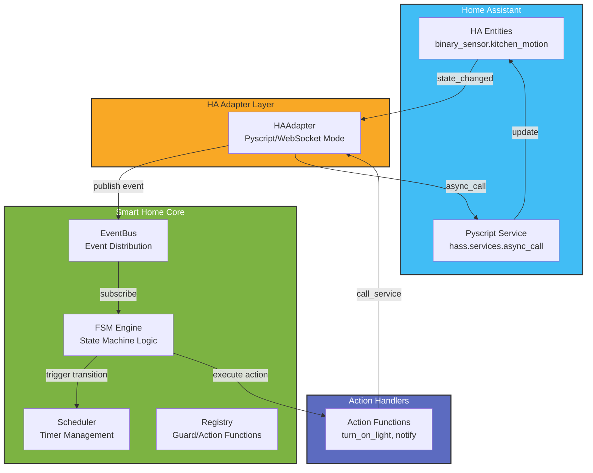

# Smart Home FSM Platform

[](https://github.com/Alkamenos/smart-home-platform/actions/workflows/ci.yml)
[](https://codecov.io/github/Alkamenos/smart-home-platform)

[](https://www.apache.org/licenses/LICENSE-2.0)
[](CHANGELOG.md)

A modern, state-machine based automation platform for smart home systems. This platform provides a robust framework for defining, managing, and executing complex home automation scenarios using finite state machines (FSM). Built with Python 3.10+, it features strict schema validation via Pydantic, declarative configuration support through YAML, structured logging with Loguru, and comprehensive testing capabilities.

## 🎉 What's New in v3.0.0

The v3.0.0 release brings major architectural improvements and powerful new features:

### Core Enhancements

- **FSM Engine v3** — Immutable state machines with enhanced transition logic, guard conditions, and timeout handling
- **EventRouter Integration** — Flexible sensor-to-FSM mapping with entity resolution from device configurations
- **Behavior Composition** — Multiple behaviors per device with priority-based conflict resolution (Critical: 20+, Night: 20, Standard: 10, Background: 1-9)
- **Middleware System** — Global rules applied automatically, including ManualLockoutMiddleware for preventing automation conflicts
- **State Persistence** — JSON-based storage with graceful shutdown and concurrent access handling
- **Pydantic v2 Validation** — Strict schema validation with automatic migrations for legacy manifests

### Architecture Improvements

- Clean `src/` layout consolidation with proper entry points
- CommandDispatcher with priority-based command resolution
- EventBus for async event distribution with end-to-end tracing
- Enhanced error isolation and exponential backoff for reconnection

See [CHANGELOG.md](CHANGELOG.md) for the complete list of changes and [MIGRATION_GUIDE.md](docs/MIGRATION_GUIDE.md) for migration instructions from v2.x.

## 🏗 Architecture Overview



### Data Flow

1. **Event Source**: Home Assistant entity changes state (e.g., motion sensor triggers)
2. **Adapter Capture**: `HAAdapter.on_state_change()` receives the event, generates `trace_id`
3. **Event Publishing**: EventBus distributes event to all subscribers with trace context
4. **FSM Processing**: FSMEngine evaluates guards, executes actions, schedules timeouts
5. **Action Execution**: Registered action functions call `HAAdapter.call_service()`
6. **Service Call**: Adapter invokes HA service to control devices

## ✨ Key Features

- **Immutable State Machines**: Thread-safe FSM definitions using dataclasses
- **Dual-Mode Adapter**: Pyscript (recommended) or WebSocket connectivity
- **End-to-End Tracing**: Every event/action has a `trace_id` for debugging
- **Exponential Backoff**: Automatic reconnection with backoff strategy
- **Graceful Shutdown**: Clean timer cancellation and resource cleanup
- **Error Isolation**: Service call failures don't crash the FSM engine
- **Guard Conditions**: Complex logic evaluation before transitions
- **Timeout Transitions**: Automatic state transitions after delay
- **Debounce Protection**: Prevents rapid state bouncing
- **Composition Pattern**: Multiple behaviors per device with priority-based conflict resolution
- **Middleware System**: Global rules applied to all commands automatically
- **Migrations**: Automatic manifest updates for backward compatibility

## 🚀 Quick Start: How to Create a New Automation

## 📋 Example Manifest Configurations

The platform supports various home configurations. See `docs/examples/` for complete examples:

- **studio_apartment.yaml** - Small studio apartment with basic lighting and climate
- **country_house.yaml** - Multi-floor house with zonal control and complex behavior composition
- **office_space.yaml** - Office environment with workspace zones and meeting rooms

### Example: Studio Apartment with Night Light Composition

```yaml
devices:
  - type: light_motion
    id: light.main_room
    name: Main Room Light
    room: main_room
    behaviors:
      # Night mode: dim light (priority 20)
      - template: night_light
        priority: 20
        params:
          brightness: 15
          schedule: "23:00-07:00"
      # Day mode: bright motion-activated light (priority 10)
      - template: lighting
        priority: 10
        params:
          motion_sensor: binary_sensor.main_room_motion
          motion_timeout_sec: 180
          schedule: "07:00-23:00"
          brightness: 255
```

**How it works:**
- At night (23:00-07:00), motion triggers dim light (brightness=15) via `night_light` behavior
- During day (07:00-23:00), motion triggers bright light (brightness=255) via `lighting` behavior
- Higher priority (20 > 10) ensures night mode overrides day mode when both are active

### Example: Middleware Configuration

```yaml
automation_rules:
  # Global lockout: block automation for 60 min after manual control
  global_manual_lockout_min: 60

  # Domain-specific overrides
  lighting:
    motion_enabled: true
    schedule_enabled: true
    manual_lockout_min: 60
  climate:
    safety_lockout_enabled: true
    away_mode_enabled: true
    manual_lockout_min: 90
  ventilation:
    humidity_based: true
    manual_lockout_min: 15
```

**How middleware works:**
- When user manually controls a device, automation is blocked for the configured duration
- Prevents automation from fighting with user preferences
- Different domains can have different lockout durations

### Example: Migration-Aware Manifest

```yaml
instance:
  id: my_house
  name: My House
  owner: John
  created_at: '2024-01-15'

version: 1  # Automatically managed by migration system

devices:
  - type: light_motion
    id: light.kitchen
    # ... device config
```

**Migration system:**
- Old manifests without `version` field are automatically updated
- New migrations are discovered and applied sequentially
- Ensures backward compatibility across platform versions

## 🔧 How to Add New Behavior

Follow these steps to add a new behavior template to the Smart Home Platform:

### Step 1: Create YAML Template in `features/`

Create a new YAML file (e.g., `features/my_new_behavior.yaml`) that defines your FSM:

```yaml
# features/my_new_behavior.yaml - ABSTRACT TEMPLATE
#
# EXPECTED PARAMETERS in params (from manifest):
#   - my_param: type - Description of parameter
#
# EXAMPLE USAGE in manifest.yaml:
#   devices:
#     - type: my_device
#       id: my_device_id
#       behaviors:
#         - template: my_new_behavior
#           priority: 15
#           params:
#             my_param: value

initial_state: "OFF"
debounce_sec: 0.5

states:
  - "OFF"
  - "ON"

transitions:
  - from_state: "OFF"
    to_state: "ON"
    trigger: "my_trigger"
    action: "my_action"
```

**Key Points:**
- Do NOT hardcode `entity_id` - it will be injected from the manifest
- Add comments explaining expected parameters
- Include an example usage in comments

### Step 2: Define Action Handlers in Python

Create action handler functions that return `CommandIntent`:

```python
# In your actions module or initialization code
from core import CommandIntent


async def my_action(state, context: dict) -> CommandIntent:
    """My custom action handler."""
    entity_id = context.get("entity_id", "default_entity")
    brightness = context.get("params", {}).get("brightness", 255)

    return CommandIntent(
        device_id=entity_id,
        domain="light",
        service="turn_on",
        data={"brightness": brightness},
        priority=context.get("priority", 10),
        source="my_new_behavior",
    )


# Register with the engine
engine.register_action("my_action", my_action)
```

**Key Points:**
- Actions receive both `state` and `context` arguments
- Return `CommandIntent` instead of calling HA directly
- Use `context.get("entity_id")` for the target device
- Set appropriate `priority` in the intent

### Step 3: Add Behavior to Manifest with Priority

Edit your instance manifest (e.g., `instances/my_house/manifest.yaml`):

```yaml
devices:
  - type: my_device_type
    id: my_device_id
    name: My Device
    room: my_room
    behaviors:
      - template: my_new_behavior
        priority: 15  # Choose priority based on importance
        params:
          my_param: value
          brightness: 100
```

**Priority Guidelines:**
| Priority | Use Case |
|----------|----------|
| 20+ | Critical/Safety (emergency override) |
| 20 | Night Light (blocks standard lighting) |
| 10 | Standard Motion Lighting |
| 1-9 | Background/Environmental control |

### Step 4: Test Your Behavior

Run tests to verify your behavior works correctly:

```bash
# Run all tests
pytest

# Run specific scenario test
pytest tests/test_composition_scenario.py -v

# Run kitchen demo
python examples/kitchen_demo.py
```

### Complete Example: Adding a "Party Mode" Behavior

**1. Create `features/party_mode.yaml`:**
```yaml
# Party mode - colorful lighting for parties
initial_state: "OFF"
states: ["OFF", "PARTY"]
transitions:
  - from_state: "OFF"
    to_state: "PARTY"
    trigger: "party_start"
    action: "start_party_lights"
  - from_state: "PARTY"
    to_state: "OFF"
    trigger: "party_end"
    action: "stop_party_lights"
```

**2. Create action handlers:**
```python
async def start_party_lights(state, context: dict) -> CommandIntent:
    return CommandIntent(
        device_id=context["entity_id"],
        domain="light",
        service="turn_on",
        data={"effect": "colorloop", "brightness": 200},
        priority=5,  # Low priority, easily overridden
        source="party_mode",
    )
```

**3. Add to manifest:**
```yaml
behaviors:
  - template: party_mode
    priority: 5
    params:
      colors: ["red", "blue", "green"]
```

### Step 1: Define Your FSM in YAML

Create a file `config/smart_home/kitchen_motion.yaml`:

```yaml
entity_id: binary_sensor.kitchen_motion
initial_state: idle
states:
  - idle
  - active
  - timeout_pending
debounce_sec: 2.0

transitions:
  # Motion detected: idle -> active
  - from_state: idle
    to_state: active
    trigger: motion_detected
    action: turn_on_kitchen_light

  # No motion for 5 minutes: active -> timeout_pending
  - from_state: active
    to_state: timeout_pending
    trigger: timeout
    timeout_sec: 300
    action: dim_kitchen_light

  # Motion during timeout: reset timer
  - from_state: timeout_pending
    to_state: active
    trigger: motion_detected
    action: brighten_kitchen_light

  # Timeout expires: timeout_pending -> idle
  - from_state: timeout_pending
    to_state: idle
    trigger: timeout
    timeout_sec: 300
    action: turn_off_kitchen_light
```

### Step 2: Register Guard and Action Functions

In your initialization code (`smart_home_bridge.py`):

```python
from core import FSMEngine
from adapters.ha_adapter import HAAdapter

# Initialize engine and adapter
engine = FSMEngine()
adapter = HAAdapter(mode="pyscript", engine=engine, hass=hass)


# Register action functions
async def turn_on_kitchen_light(ctx: dict) -> bool:
    """Turn on kitchen light when motion detected."""
    return await adapter.call_service(
        domain="light",
        service="turn_on",
        entity_id="light.kitchen",
        data={"brightness": 255},
        trace_id=ctx.get("trace_id"),
    )


async def turn_off_kitchen_light(ctx: dict) -> bool:
    """Turn off kitchen light when no motion."""
    return await adapter.call_service(
        domain="light",
        service="turn_off",
        entity_id="light.kitchen",
        trace_id=ctx.get("trace_id"),
    )


async def dim_kitchen_light(ctx: dict) -> bool:
    """Dim lights when entering timeout state."""
    return await adapter.call_service(
        domain="light",
        service="turn_on",
        entity_id="light.kitchen",
        data={"brightness": 50},
        trace_id=ctx.get("trace_id"),
    )


# Register actions with engine
engine.register_action("turn_on_kitchen_light", turn_on_kitchen_light)
engine.register_action("turn_off_kitchen_light", turn_off_kitchen_light)
engine.register_action("dim_kitchen_light", dim_kitchen_light)


# Optional: Register guard functions
def is_night_time(ctx: dict) -> bool:
    """Only allow automation at night."""
    from datetime import datetime

    hour = datetime.now().hour
    return hour < 7 or hour > 22


engine.register_guard("is_night_time", is_night_time)
```

### Step 3: Wire Up State Change Handlers

In Pyscript (`/config/pyscript/smart_home_bridge.py`):

```python
@state_trigger("binary_sensor.kitchen_motion")
def kitchen_motion_changed(value=None, old_value=None):
    """Handle motion sensor state changes."""
    if value == "on" and old_value == "off":
        adapter.on_state_change(
            entity_id="binary_sensor.kitchen_motion",
            new_state="on",
            old_state="off",
            context={},
        )
```

### Step 4: Load FSM Definitions

```python
from core import DefinitionLoader

loader = DefinitionLoader(registry=registry, engine=engine)
loader.load_definitions("/config/smart_home/")
```

## 🔍 Understanding Trace IDs

Every event and action in the platform has a unique `trace_id` (first 8 characters of UUID) for debugging:

```
[trace_id: a1b2c3d4] HAAdapter: state_change received for binary_sensor.kitchen_motion: 'off' -> 'on'
[trace_id: a1b2c3d4] EventBus: Publishing event: state_change
[trace_id: a1b2c3d4] FSM Engine: Entity binary_sensor.kitchen_motion: Transition 'idle' -> 'active' triggered by 'motion_detected'
[trace_id: a1b2c3d4] HAAdapter: calling service light.turn_on for light.kitchen
[trace_id: a1b2c3d4] HAAdapter: service light.turn_on called successfully
```

**Search by trace_id in logs** to follow the complete chain of events across all components.

## 🔄 Migration Guide: v2.x → v3.0.0

This section helps you migrate your existing v2.x configurations to v3.0.0.

### Automatic Migrations

The platform includes an automatic migration system that updates legacy manifests:

- Manifests without `version` field are automatically updated to the latest schema
- Old configuration structures are transformed to match v3 requirements
- Migration scripts run on platform startup

### Manual Changes Required

#### 1. Behavior Templates

**Before (v2.x):**
```yaml
behaviors:
  - template: lighting
    entity_id: light.kitchen  # Hardcoded entity_id
    params:
      motion_sensor: binary_sensor.kitchen_motion
```

**After (v3.0.0):**
```yaml
devices:
  - type: light_motion
    id: light.kitchen  # entity_id moved to device level
    behaviors:
      - template: lighting
        priority: 10  # Priority is now required
        params:
          motion_sensor: binary_sensor.kitchen_motion
```

#### 2. Middleware Configuration

**Before (v2.x):**
```yaml
manual_lockout_min: 60
```

**After (v3.0.0):**
```yaml
automation_rules:
  global_manual_lockout_min: 60
  lighting:
    manual_lockout_min: 60
  climate:
    manual_lockout_min: 90
```

#### 3. Priority Assignment

All behaviors must now have explicit priority values:

| Priority | Use Case | Example |
|----------|----------|---------|
| 20+ | Critical/Safety | Emergency override, fire alarm |
| 20 | Night Light | Dim lighting during night hours |
| 10 | Standard Motion | Regular motion-activated lighting |
| 1-9 | Background | Environmental control, ventilation |

#### 4. Device-Level Sensors

Sensors can now be defined at device level instead of behavior level:

```yaml
devices:
  - type: light_motion
    id: light.kitchen
    sensors:
      motion: binary_sensor.kitchen_motion
      brightness: sensor.kitchen_lux
    behaviors:
      - template: lighting
        priority: 10
```

### Testing Your Migration

1. Run validation before starting:
   ```bash
   python cli.py validate instances/your_instance/manifest.yaml
   ```

2. Check health after startup:
   ```bash
   python cli.py health
   ```

3. Review logs for any migration warnings

For detailed migration instructions, see [docs/MIGRATION_GUIDE.md](docs/MIGRATION_GUIDE.md).

## 🛠 Local Development

### Prerequisites

```bash
# Install Python 3.10+
python --version  # Should be 3.10 or higher

# Install dependencies
pip install -e ".[dev]"
```

### Running Tests

```bash
# Run all tests with coverage
pytest

# Run specific test file
pytest tests/test_fsm.py -v

# Run tests with live reload (using pytest-watch)
ptw --runner "pytest -x"

# Run tests with freezegun for time-based tests
pytest tests/test_scheduler.py -v  # freezegun is auto-loaded in tests
```

### Example Test with Freezegun

```python
from freezegun import freeze_time
import pytest


@pytest.mark.asyncio
@freeze_time("2024-01-15 10:30:00")
async def test_timeout_transition():
    """Test that timeout transitions occur at the right time."""
    engine = FSMEngine()
    # ... setup FSM ...

    # Trigger initial state
    await engine.trigger("sensor_1", "motion_detected")

    # Fast-forward time by 5 minutes
    with freeze_time("2024-01-15 10:35:00"):
        # Timeout should have fired
        state = engine.get_state("sensor_1")
        assert state.current_state == "timeout_pending"
```

### Linting and Code Quality

```bash
# Run linter (if ruff/flake8 configured)
make lint

# Type checking with mypy
mypy src/

# Format code with black
black src/ tests/
```

## 📁 Project Structure

```
smart-home-fsm-platform/
├── src/smart_home/
│   ├── adapters/
│   │   ├── ha_adapter.py       # HA integration (Pyscript/WebSocket)
│   │   └── mock_adapter.py     # Mock adapter for testing
│   ├── bootstrap.py            # Platform bootstrap and initialization
│   ├── cli/
│   │   ├── __init__.py
│   │   ├── main.py             # CLI entry point
│   │   └── commands/           # CLI commands
│   ├── core/
│   │   ├── fsm.py              # FSM Engine, State, Transition
│   │   ├── event_bus.py        # Event distribution
│   │   ├── scheduler.py        # Timer management
│   │   ├── registry.py         # Guard/Action registration
│   │   └── loader.py           # YAML definition loader
│   ├── dashboard/
│   │   └── lovelace_generator.py  # Dashboard generation
│   ├── features/
│   │   └── lighting.py         # Lighting automation templates
│   ├── migrations/
│   │   └── runner.py           # Manifest migration system
│   └── services/
│       ├── config_watcher.py   # Configuration file watcher
│       ├── dashboard_generator.py  # Dashboard generation service
│       └── watchdog.py         # Health monitoring
├── tests/
│   ├── test_fsm.py             # FSM engine tests
│   ├── test_ha_adapter.py      # Adapter tests
│   └── test_scenarios.py       # End-to-end scenarios
├── examples/
│   ├── generated_dashboards/   # Generated dashboard examples
│   ├── instances/
│   │   └── leonids_house/      # Example instance configuration
│   ├── demo_loader.py          # Loader demonstration
│   ├── full_house_demo.py      # Full house automation demo
│   ├── ha_pyscript_integration.py  # Pyscript example
│   └── kitchen_demo.py         # Kitchen automation demo
├── scripts/
│   ├── cleanup_branches.sh     # Git branch cleanup
│   ├── generate_docs.sh        # Documentation generation
│   └── run_mock.sh             # Mock server runner
├── docs/
│   └── architecture.md         # Architecture documentation
├── cli.py                      # Backward compatibility shim
├── Makefile                    # Build aliases
├── pyproject.toml              # Project configuration
└── README.md                   # This file
```

## 🔄 HA Adapter Modes

### Pyscript Mode (Recommended)

**Pros:**
- Hot-reload in 1 second
- Direct access to `hass` object
- No WebSocket complexity
- Runs inside HA process

**Usage:**
```python
adapter = HAAdapter(mode="pyscript", engine=engine, hass=hass)
```

### WebSocket Mode (Standalone)

**Pros:**
- Runs outside HA process
- Can be deployed separately
- Better isolation

**Cons:**
- Requires `homeassistant-websocket` library
- More complex reconnection logic

**Usage:**
```python
adapter = HAAdapter(
    mode="websocket",
    engine=engine,
    ws_url="ws://localhost:8123/api/websocket",
    token="your_long_lived_token",
)
await adapter.start()
```

## 🧩 Advanced Features

### Manual Override Protection

Store context in State to detect manual overrides:

```python
def manual_override_guard(ctx: dict) -> bool:
    """Prevent auto-off if user manually turned on light."""
    import time

    manual_at = ctx.get("context", {}).get("manual_override_at", 0)
    if manual_at and (time.time() - manual_at) < 3600:
        return False  # Block transition for 1 hour
    return True


engine.register_guard("no_manual_override", manual_override_guard)
```

### Debounce Protection

Prevents rapid state changes:

```yaml
entity_id: binary_sensor.noisy_sensor
debounce_sec: 2.0  # Ignore events within 2 seconds
```

### Timeout Chains

Create complex timeout sequences:

```yaml
transitions:
  - from_state: active
    to_state: dimmed
    trigger: timeout
    timeout_sec: 300
    action: dim_lights

  - from_state: dimmed
    to_state: off
    trigger: timeout
    timeout_sec: 300
    action: turn_off_lights
```

## 📊 Monitoring and Debugging

### Log Configuration

Add to your `logging.yaml` in HA:

```yaml
logger:
  default: warning
  logs:
    pyscript.smart_home_bridge: info
    src.smart_home: debug
```

### Finding Issues by Trace ID

```bash
# Search logs for specific trace
grep "a1b2c3d4" /config/home-assistant.log

# Follow all events for an entity
grep "kitchen_motion" /config/home-assistant.log | grep "trace_id"
```

## 🤝 Contributing

1. Fork the repository
2. Create a feature branch
3. Write tests for new functionality
4. Ensure all tests pass: `make test`
5. Submit a pull request

## License

This project is licensed under the Apache License 2.0 — see the [LICENSE](LICENSE) file for details.

## 🙏 Acknowledgments

- Home Assistant community for Pyscript
- Loguru for excellent logging
- Pydantic for schema validation
