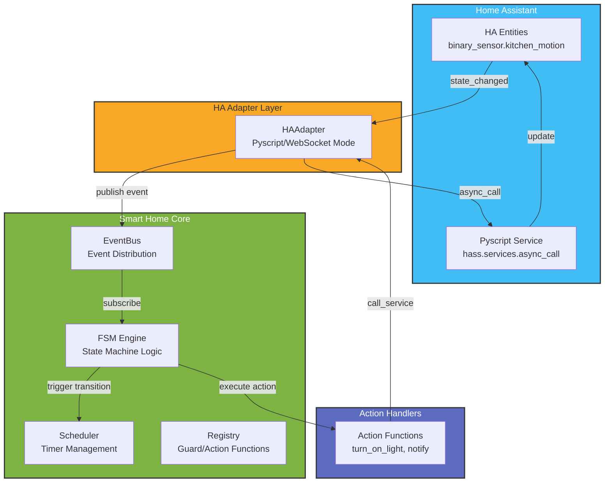

# Smart Home FSM Platform

[](https://github.com/Alkamenos/smart-home-platform/actions/workflows/ci.yml)
[](https://codecov.io/github/Alkamenos/smart-home-platform)

[](https://www.apache.org/licenses/LICENSE-2.0)
[](CHANGELOG.md)

A modern, state-machine based automation platform for smart home systems. This platform provides a robust framework for defining, managing, and executing complex home automation scenarios using finite state machines (FSM). Built with Python 3.10+, it features strict schema validation via Pydantic, declarative configuration support through YAML, structured logging with Loguru, and comprehensive testing capabilities.

> 📚 **Документация:** [docs/README.md](docs/README.md) · 🔧 **Разработка:** [.ai/00_START_HERE.md](.ai/00_START_HERE.md) · 📋 **Конституция:** [CLAUDE.md](CLAUDE.md)

## 🎉 What's New in v3.0.0

The v3.0.0 release brings major architectural improvements and powerful new features:

### Core Enhancements

- **FSM Engine v3** — Immutable state machines with enhanced transition logic, guard conditions, and timeout handling
- **EventRouter Integration** — Flexible sensor-to-FSM mapping with entity resolution from device configurations
- **Behavior Composition** — Multiple behaviors per device with priority-based conflict resolution (Critical: 20+, Night: 20, Standard: 10, Background: 1-9)
- **Middleware System** — Global rules applied automatically, including ManualLockoutMiddleware for preventing automation conflicts
- **State Persistence** — JSON-based storage with graceful shutdown and concurrent access handling
- **Pydantic v2 Validation** — Strict schema validation with automatic migrations for legacy manifests

### Architecture Improvements

- Clean `src/` layout consolidation with proper entry points
- CommandDispatcher with priority-based command resolution
- EventBus for async event distribution with end-to-end tracing
- Enhanced error isolation and exponential backoff for reconnection

See [CHANGELOG.md](CHANGELOG.md) for the complete list of changes and [Migration Guide](docs/guides/migration-v2-to-v3.md) for migration instructions from v2.x.

## 🏗 Architecture Overview


```mermaid
flowchart TB
    subgraph HomeAssistant["Home Assistant"]
        HA[HA Entities<br/>binary_sensor.kitchen_motion]
        PSS[Pyscript Service<br/>hass.services.async_call]
    end

    subgraph Adapter["HA Adapter Layer"]
        HAA[HAAdapter<br/>Pyscript/WebSocket Mode]
    end

    subgraph Core["Smart Home Core"]
        EB[EventBus<br/>Event Distribution]
        FSM[FSM Engine<br/>State Machine Logic]
        SCH[Scheduler<br/>Timer Management]
        REG[Registry<br/>Guard/Action Functions]
    end

    subgraph Actions["Action Handlers"]
        ACT[Action Functions<br/>turn_on_light, notify]
    end

    HA -->|state_changed| HAA
    HAA -->|publish event| EB
    EB -->|subscribe| FSM
    FSM -->|trigger transition| SCH
    FSM -->|execute action| ACT
    ACT -->|call_service| HAA
    HAA -->|async_call| PSS
    PSS -->|update| HA

    style HomeAssistant fill:#41bdf5,stroke:#333,stroke-width:2px,color:#fff
    style Adapter fill:#f9a825,stroke:#333,stroke-width:2px
    style Core fill:#7cb342,stroke:#333,stroke-width:2px,color:#fff
    style Actions fill:#5c6bc0,stroke:#333,stroke-width:2px,color:#fff
```

### Data Flow

1. **Event Source**: Home Assistant entity changes state (e.g., motion sensor triggers)
2. **Adapter Capture**: `HAAdapter.on_state_change()` receives the event, generates `trace_id`
3. **Event Publishing**: EventBus distributes event to all subscribers with trace context
4. **FSM Processing**: FSMEngine evaluates guards, executes actions, schedules timeouts
5. **Action Execution**: Registered action functions call `HAAdapter.call_service()`
6. **Service Call**: Adapter invokes HA service to control devices

## ✨ Key Features

- **Immutable State Machines**: Thread-safe FSM definitions using dataclasses
- **Dual-Mode Adapter**: Pyscript (recommended) or WebSocket connectivity
- **End-to-End Tracing**: Every event/action has a `trace_id` for debugging
- **Exponential Backoff**: Automatic reconnection with backoff strategy
- **Graceful Shutdown**: Clean timer cancellation and resource cleanup
- **Error Isolation**: Service call failures don't crash the FSM engine
- **Guard Conditions**: Complex logic evaluation before transitions
- **Timeout Transitions**: Automatic state transitions after delay
- **Debounce Protection**: Prevents rapid state bouncing
- **Composition Pattern**: Multiple behaviors per device with priority-based conflict resolution
- **Middleware System**: Global rules applied to all commands automatically
- **Migrations**: Automatic manifest updates for backward compatibility
- **FSM Visualization**: Export FSM diagrams in Mermaid and Graphviz formats for documentation and debugging

## 📚 Documentation

### Guides

| Guide | Description |
|-------|-------------|
| [Quick Start: Adding Devices](docs/guides/quickstart-add-devices.md) | Bulk import 200+ devices from Home Assistant |
| [FSM Visualization](docs/guides/fsm-visualization.md) | Export FSM diagrams (Mermaid / Graphviz) |
| [Example Manifest Configurations](docs/guides/manifest-examples.md) | Manifest examples: composition, middleware, migrations |
| [How to Add New Behavior](docs/guides/adding-behavior.md) | Create and register your own behavior template |
| [Understanding Trace IDs](docs/guides/trace-ids.md) | End-to-end event debugging |
| [Migration Guide v2.x → v3.0.0](docs/guides/migration-v2-to-v3.md) | Migrate existing v2.x configurations |
| [Local Development](docs/guides/local-development.md) | Tests, linting, quality checks |
| [HA Adapter Modes](docs/guides/ha-adapter-modes.md) | Pyscript vs WebSocket connectivity |
| [Advanced Features](docs/guides/advanced-features.md) | Manual override, debounce, timeout chains |
| [Monitoring and Debugging](docs/guides/monitoring-debugging.md) | Log configuration, trace search |

### References

- **[docs/README.md](docs/README.md)** — API reference and specifications
- **[.ai/00_START_HERE.md](.ai/00_START_HERE.md)** — development workflow for AI assistants
- **[CHANGELOG.md](CHANGELOG.md)** — release history
- **[CONTRIBUTING.md](CONTRIBUTING.md)** — contribution guidelines

## 📁 Project Structure

```
smart-home-platform/
├── src/
│   ├── adapters/              # Integrations: HAAdapter (Pyscript/WebSocket), MockAdapter
│   ├── core/                  # Business logic
│   │   ├── fsm/               # FSM engine, factory, Mermaid/Graphviz visualizer
│   │   ├── events/            # EventBus, EventRouter, device events
│   │   ├── commands/          # CommandDispatcher + middleware
│   │   ├── scheduling/        # Scheduler (timeout transitions)
│   │   ├── discovery/         # Device discovery from Home Assistant
│   │   ├── persistence/       # State storage, WebSocket event batcher
│   │   ├── guards/            # Guard functions (composite, numeric)
│   │   └── models/            # Domain models
│   ├── cli/                   # CLI entry point (shp): bulk-import, export-fsm, shell
│   ├── services/              # Config watcher, backup, watchdog, metrics server
│   ├── dashboard/             # Lovelace dashboard generator
│   ├── webui/                 # Web UI (FastAPI + HTMX): discovery, FSM view
│   ├── features/              # YAML behavior templates (lighting, climate, ...)
│   ├── smart_home/            # Installable package (CLI entry point)
│   └── bootstrap.py           # Platform initialization
├── tests/                     # unit/ integration/ contract/ security/ validation/
├── instances/leonids_house/   # Example manifest instance
├── examples/                  # Code examples (batcher, pyscript, sample plugin)
├── fsm_demo/                  # Runnable demos (kitchen_demo, full_house_demo)
├── docs/                      # Documentation (start at docs/README.md)
├── deploy/                    # Docker deployment for Home Assistant
├── .ai/                       # AI context: workflow, rules, enhancements backlog
├── specs/                     # Feature specifications (Spec Kit)
├── Makefile                   # Build/test/lint aliases
└── pyproject.toml             # Dependencies and tool configuration
```

## 📖 Specifications

### Device Import Workflow

For detailed information on bulk device import, classification, and room assignment, see [docs/api/device-import-spec.md](docs/api/device-import-spec.md).

This specification covers:
- **Discovery Phase**: How devices are scanned from Home Assistant
- **Classification Phase**: Automatic device type detection
- **Room Assignment**: Mapping devices to rooms
- **FSM Application**: Behavior template selection
- **Safety Mechanisms**: Backup, dry-run, validation
- **User Workflows**: CLI, Web UI, and programmatic APIs

The platform also uses GitHub spec kit to document major workflows — see the [`specs/`](specs/) directory.

## 🤝 Contributing

1. Fork the repository
2. Create a feature branch
3. Write tests for new functionality
4. Ensure all tests pass: `make test`
5. Submit a pull request

## License

This project is licensed under the Apache License 2.0 — see the [LICENSE](LICENSE) file for details.

## 🙏 Acknowledgments

- Home Assistant community for Pyscript
- Loguru for excellent logging
- Pydantic for schema validation
