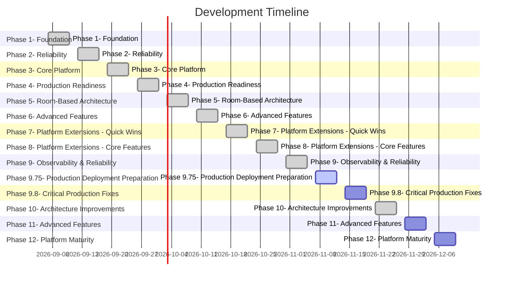

# 🗺 Smart Home Platform Roadmap

*Автоматически сгенерировано из `.ai/03_ROADMAP.md`. Не редактировать вручную.*

## 📌 📌 Как использовать этот файл

---

## 📌 Status Legend

- `[x]` Completed — задача выполнена, файлы кода существуют
- `[ ]` In Progress — задача в работе
- `[ ]` Planned — запланирована
- `[x]` Cancelled — отменена

## ✅ Phase 1: Foundation

**Status:** COMPLETED: 2026-09-05

- ✅ Basic FSM engine with states and transitions
- ✅ EventBus for async event distribution
- ✅ Scheduler for timeout management
- ✅ Registry for guard/action functions
- ✅ YAML loader for FSM definitions

## ✅ Phase 2: Reliability

**Status:** COMPLETED: 2026-09-08

- ✅ State persistence (JSON storage)
- ✅ Control tracker for manual/automated sources
- ✅ Debounce protection
- ✅ Cooldown and manual lockout in transitions
- ✅ Watchdog service for health monitoring

## ✅ Phase 3: Core Platform

**Status:** COMPLETED: 2026-09-13

- ✅ Pydantic v2 manifest validation (commit: 701c7ab)
- ✅ CommandDispatcher with priority resolution (commit: 8cee5aa)
- ✅ EventRouter for sensor-to-FSM mapping (commit: a3126c4)
- ✅ Middleware system (ManualLockoutMiddleware) (commit: edccfd3)
- ✅ Composition pattern with behaviors (commit: 869ac4d)
- ✅ E2E composition tests (commit: c3007a6)
- ✅ CLI with validate/doctor/health commands (commit: 955f2f0)
- ✅ State persistence with graceful shutdown
- ✅ Docker integration tests

## ✅ Phase 4: Production Readiness

**Status:** COMPLETED: 2026-09-15

- ✅ **CRITICAL** Consolidate project structure (remove code duplication)
- Issue: Code exists in both `core/` and `../src/core/`
- Action: Migrate fully to `src` layout, remove flat structure
- Impact: All imports, pyproject.toml, cli.py
- ✅ **CRITICAL** Fix manifest bug: add `motion_sensor` to night_light params
- File: `instances/leonids_house/manifest.yaml`
- Issue: `01_PROJECT_STATE.md` → Known Issues #1
- ✅ Clean up legacy tests
- Remove: `tests/test_legacy_*.py`
- Add: middleware tests, CLI tests, WebSocket reconnect tests
- ✅ Add pre-commit hooks
- pytest, mypy, ruff, black
- ✅ Update README.md with new architecture diagrams
- ✅ Add code coverage badge

## ✅ Phase 5: Room-Based Architecture

**Status:** COMPLETED: 2026-09-15

- ✅ Refactor Manifest: devices nested inside rooms
- ✅ Sensors describe room state, devices are actuators
- ✅ Same sensor can be referenced from multiple rooms
- ✅ Update EventRouter for room-based routing
- ✅ Update LovelaceGenerator for new structure
- ✅ Update FSMFactory.create_from_manifest()
- ✅ Update all tests
- ✅ Remove migration tests (no external users)

## ✅ Phase 6: Advanced Features

**Status:** COMPLETED: 2026-09-18

- ✅ Web UI for manifest editing
- FastAPI + HTMX
- Form validation using Pydantic models
- Files: `src/webui/app.py`, `src/webui/routes.py`, `src/webui/models.py`, `tests/test_webui.py`
- Implementation date: 2026-09-17
- ✅ Prometheus metrics export
- `/metrics` endpoint
- FSM state changes, command latency, error rates
- Files: `core/metrics.py`, `tests/test_metrics.py`
- Implementation date: 2026-09-16
- ✅ Hot-reload without restart
- File watcher for manifest changes
- Graceful FSM migration (unregister old, register new)
- Files: `services/config_watcher.py`, `tests/test_hot_reload.py`
- Implementation date: 2026-09-17

## ✅ Phase 7: Platform Extensions - Quick Wins

**Status:** COMPLETED: 2026-09-18

- ✅ Declarative Guards DSL
- Files: `core/guards/`, `core/fsm.py`
- Detail: `.ai/enhancements/01-declarative-guards-dsl.md`
- Priority: HIGH
- Effort: 1-2 days
- ✅ FSM Visualization (Mermaid/Graphviz)
- Files: `core/fsm_visualizer.py`, `cli/commands/export_fsm.py`
- Detail: `.ai/enhancements/02-fsm-visualization.md`
- Priority: MEDIUM
- Effort: 1 day
- ✅ Interactive REPL
- Files: `src/smart_home/cli/commands/shell.py`, `tests/test_shell.py`
- Detail: `.ai/enhancements/03-interactive-repl.md`
- Priority: LOW
- Effort: 0.5 days
- Implementation date: 2026-09-18

## ✅ Phase 8: Platform Extensions - Core Features

**Status:** COMPLETED: 2026-09-19

- ✅ Scene Manager / Flow Engine
- Files: `core/scene_manager.py`, `core/models/scene.py`
- Detail: `.ai/enhancements/04-scene-manager.md`
- Priority: HIGH
- Effort: 2-3 days
- Implementation date: 2026-09-18
- ✅ Room Aggregation & Policies
- Files: `core/room_manager.py`, `core/models/room.py`
- Detail: `.ai/enhancements/05-room-aggregation.md`
- Priority: MEDIUM
- Effort: 2 days
- Implementation date: 2026-09-19
- ✅ Digital Twin / Simulator
- Files: `core/simulator.py`, `core/models/simulation.py`, `tests/test_digital_twin.py`
- Detail: `.ai/enhancements/06-digital-twin.md`
- Priority: MEDIUM
- Effort: 2-3 days
- Implementation date: 2026-09-19

## ✅ Phase 9: Observability & Reliability

**Status:** COMPLETED: 2026-09-19

- ✅ Prometheus / OpenTelemetry Metrics
- Files: `core/metrics.py`, `services/metrics_server.py`
- Detail: `.ai/enhancements/07-prometheus-metrics.md`
- Priority: HIGH
- Effort: 1-2 days
- ✅ Circuit Breaker Pattern
- File: `adapters/ha_adapter.py`
- Detail: `.ai/enhancements/08-circuit-breaker.md`
- Priority: HIGH
- Effort: 1 day
- [ ] Secrets Management
- File: `core/secrets.py`
- Detail: `.ai/enhancements/09-secrets-management.md`
- Priority: MEDIUM
- Effort: 1 day

## 🔄 Phase 9.75: Production Deployment Preparation

**Status:** IN PROGRESS

- ✅ Safe Deployment Strategy for Home Assistant
- Detail: `.ai/enhancements/16-safe-deployment.md`
- Priority: CRITICAL
- Effort: 2-3 days
- User Stories:
- ✅ Enhanced Logging Integration
- Detail: `.ai/enhancements/17-enhanced-logging.md`
- Priority: HIGH
- Effort: 1-2 days
- User Stories:
- ✅ Automatic Manifest Generator from Real Devices
- Detail: `.ai/enhancements/18-automatic-manifest-generator.md`
- Priority: HIGH
- Effort: 1-2 days
- User Stories:
- [ ] Dashboard Generator for Platform Management
- Detail: `.ai/enhancements/19-dashboard-generator.md`
- Priority: MEDIUM
- Effort: 1 day
- User Stories:

## 📌 Phase 9.8: Critical Production Fixes

**Status:** PLANNING

- Files: deploy/docker/Dockerfile, src/main.py, pyproject.toml
- Detail: .ai/enhancements/20-docker-entrypoint-fix.md
- Priority: CRITICAL
- Effort: 0.5 days
- File: src/adapters/ha_adapter.py
- Detail: .ai/enhancements/21-websocket-reconnect.md
- Priority: CRITICAL
- Effort: 1 day
- Files: src/core/commands/dispatcher.py, src/core/commands/models.py
- Detail: .ai/enhancements/22-intent-ttl-dispatcher.md
- Priority: HIGH
- Effort: 1 day

## ✅ Phase 10: Architecture Improvements

**Status:** COMPLETED: 2026-09-19

- ✅ Domain-Driven Design Refactoring
- Files: `core/fsm/`, `core/events/`, `core/commands/`, `core/persistence/`, `core/scheduling/`, `core/guards/`, `core/models/`
- Detail: `.ai/enhancements/11-ddd-refactoring.md`
- Priority: MEDIUM
- Effort: 1-2 days
- ✅ Plugin System
- File: `core/plugin_loader.py`
- Detail: `.ai/enhancements/12-plugin-system.md`
- Priority: LOW
- Effort: 2-3 days
- ✅ Dependency Injection
- File: `core/container.py`, `bootstrap.py`
- Detail: `.ai/enhancements/13-dependency-injection.md`
- Priority: LOW
- Effort: 2-3 days
- Implementation date: 2026-09-19

## 📌 Phase 11: Advanced Features

**Status:** PLANNING

- [ ] LLM / NLP Adapter
- Files: `adapters/nlp_adapter.py`, `core/nlp_parser.py`
- Detail: `.ai/enhancements/10-llm-nlp-adapter.md`
- Priority: LOW
- Effort: 3-5 days
- [ ] Hot-Reloading для Guard/Action функций
- Files: `services/config_watcher.py`, `core/registry.py`
- Detail: `.ai/enhancements/14-hot-reloading.md`
- Priority: LOW
- Effort: 1-2 days
- [ ] Event History Persistence (Data Lake)
- Files: src/analytics/db.py, src/analytics/history_recorder.py
- Detail: .ai/enhancements/23-event-history-persistence.md
- Priority: HIGH
- Effort: 2 days
- Files: src/core/middleware/predictiveai.py, src/analytics/routineanalyzer.py
- Detail: .ai/enhancements/24-predictive-ai-middleware.md
- Priority: MEDIUM
- Effort: 3-5 days

## 🔮 Phase 12: Platform Maturity

**Status:** FUTURE

- [ ] Plugin system for custom behaviors
- [ ] Multi-instance support (multiple houses)
- [ ] Voice assistant integration (Alexa, Google)
- [ ] Machine learning for behavior optimization

## 📌 Technical Debt

### High Priority

### Medium Priority
- File: `adapters/ha_adapter.py`
- Fix: Add tests with mocked connection failures
- File: `cli.py`
- Fix: Add end-to-end CLI tests

### Low Priority
- File: `tools/dashboard_generator.py`
- Fix: Refactor to Jinja2 templates

## 📌 Cancelled Ideas

### GraphQL API
- **Reason:** Too complex for current scale. REST/WebSocket is sufficient.
- **Date cancelled:** 2026-09-10

### Multi-tenant support
- **Reason:** Premature optimization. Focus on single-house reliability first.
- **Date cancelled:** 2026-09-12

### Visual FSM editor
- **Reason:** YAML with composition pattern is more maintainable than visual editing.
- **Date cancelled:** 2026-09-13
