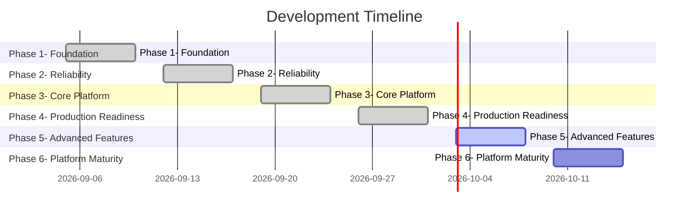

# 🗺 Smart Home Platform Roadmap

*Автоматически сгенерировано из `.ai/03_ROADMAP.md`. Не редактировать вручную.*

## 📌 Status Legend

- ✅ Completed
- [ ] In Progress
- [ ] Planned
- ✅ Cancelled

## ✅ Phase 1: Foundation

**Status:** COMPLETED: 2026-09-05

- ✅ Basic FSM engine with states and transitions
- ✅ EventBus for async event distribution
- ✅ Scheduler for timeout management
- ✅ Registry for guard/action functions
- ✅ YAML loader for FSM definitions

## ✅ Phase 2: Reliability

**Status:** COMPLETED: 2026-09-08

- ✅ State persistence (JSON storage)
- ✅ Control tracker for manual/automated sources
- ✅ Debounce protection
- ✅ Cooldown and manual lockout in transitions
- ✅ Watchdog service for health monitoring

## ✅ Phase 3: Core Platform

**Status:** COMPLETED: 2026-09-13

- ✅ Pydantic v2 manifest validation (commit: 701c7ab)
- ✅ CommandDispatcher with priority resolution (commit: 8cee5aa)
- ✅ EventRouter for sensor-to-FSM mapping (commit: a3126c4)
- ✅ Middleware system (ManualLockoutMiddleware) (commit: edccfd3)
- ✅ Composition pattern with behaviors (commit: 869ac4d)
- ✅ E2E composition tests (commit: c3007a6)
- ✅ CLI with validate/doctor/health commands (commit: 955f2f0)
- ✅ State persistence with graceful shutdown
- ✅ Docker integration tests

## ✅ Phase 4: Production Readiness

**Status:** COMPLETED: 2026-09-15

- ✅ **CRITICAL** Consolidate project structure (remove code duplication)
- Issue: Code exists in both `core/` and `src/smart_home/core/`
- Action: Migrate fully to `src` layout, remove flat structure
- Impact: All imports, pyproject.toml, cli.py
- ✅ **CRITICAL** Fix manifest bug: add `motion_sensor` to night_light params
- File: `instances/leonids_house/manifest.yaml`
- Issue: `01_PROJECT_STATE.md` → Known Issues #1
- ✅ Clean up legacy tests
- Remove: `tests/test_legacy_*.py`
- Add: middleware tests, CLI tests, WebSocket reconnect tests
- ✅ Add pre-commit hooks
- pytest, mypy, ruff, black
- ✅ Update README.md with new architecture diagrams
- ✅ Add code coverage badge

## 🔄 Phase 5: Advanced Features

**Status:** IN PROGRESS

- [ ] Device-level sensors (avoid duplication in behavior params)
- Add `sensors:` field to device in manifest
- EventRouter reads from device level first, then behavior level
- [ ] Web UI for manifest editing
- FastAPI + HTMX
- Form validation using Pydantic models
- [ ] Prometheus metrics export
- `/metrics` endpoint
- FSM state changes, command latency, error rates
- [ ] Hot-reload without restart
- File watcher for manifest changes
- Graceful FSM migration (unregister old, register new)

## 🔮 Phase 6: Platform Maturity

**Status:** FUTURE

- [ ] Plugin system for custom behaviors
- [ ] Multi-instance support (multiple houses)
- [ ] Voice assistant integration (Alexa, Google)
- [ ] Machine learning for behavior optimization

## 📌 Technical Debt

### High Priority

### Medium Priority
- File: `adapters/ha_adapter.py`
- Fix: Add tests with mocked connection failures
- File: `cli.py`
- Fix: Add end-to-end CLI tests

### Low Priority
- File: `tools/dashboard_generator.py`
- Fix: Refactor to Jinja2 templates

## 📌 Cancelled Ideas

### GraphQL API
- **Reason:** Too complex for current scale. REST/WebSocket is sufficient.
- **Date cancelled:** 2026-09-10

### Multi-tenant support
- **Reason:** Premature optimization. Focus on single-house reliability first.
- **Date cancelled:** 2026-09-12

### Visual FSM editor
- **Reason:** YAML with composition pattern is more maintainable than visual editing.
- **Date cancelled:** 2026-09-13
