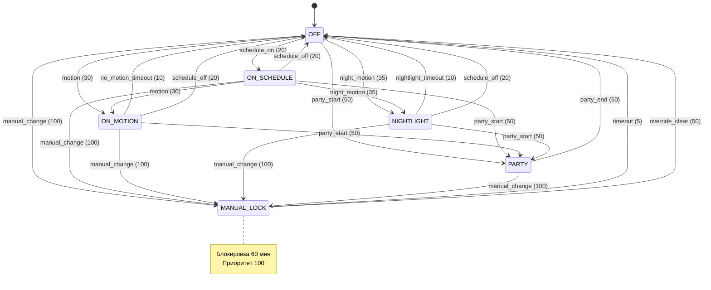

# FSM Design: Освещение (Фаза 4)

**Версия:** 0.1.0  
**Дата:** 2026-09-03  
**Статус:** Реализовано

---

## 1. Архитектурное решение по ортогональности

### Вариант 1: Иерархические состояния (выбран)

**Описание:** Состояния кодируют комбинации режимов в одном автомате.

**Преимущества:**
- Простота реализации в текущем движке `fsm_engine.py`
- Явная видимость всех возможных комбинаций
- Легче отлаживать (одно состояние = один режим)

**Недостатки:**
- Взрыв состояний при добавлении новых режимов
- Дублирование переходов между похожими состояниями

**Пример состояний:**
```
OFF → ON_SCHEDULE → ON_MOTION → NIGHTLIGHT → PARTY → MANUAL_LOCK
```

### Вариант 2: Параллельные автоматы (альтернатива)

**Описание:** Два независимых автомата работают параллельно:
- **Режимный автомат:** OFF / AUTO / MANUAL_LOCK / PARTY
- **Автомат источника:** SCHEDULE / MOTION / NIGHTLIGHT / IMITATION

**Преимущества:**
- Нет взрыва состояний
- Ортогональность обеспечивается архитектурой

**Недостатки:**
- Требует модификации `fsm_engine.py` для поддержки параллельных автоматов
- Сложнее логирование и отладка

**Решение:** Выбран **Вариант 1** (иерархические состояния) как менее инвазивный и совместимый с текущим движком.

---

## 2. Граф состояний и переходов

### Mermaid-диаграмма



---

## 3. Матрица приоритетов переходов

| Приоритет | Категория | Триггеры | Примеры |
|-----------|-----------|----------|---------|
| 1000 | Аварийный | `emergency` | Пожар, протечка |
| 100 | Ручное вмешательство | `manual_change` | Пользователь тронул выключатель |
| 50 | Режимы | `party_start`, `party_end`, `override_clear` | Вечеринка, сброс блокировки |
| 35 | Ночник | `night_motion` | Движение ночью с ночником |
| 30 | Датчики | `motion` | Движение днём/в темноте |
| 25 | Расписание (выкл) | `schedule_off` | Рассвет/время выключения |
| 20 | Расписание (вкл) | `schedule_on` | Закат/время включения |
| 15 | Имитация | `imitation_on`, `imitation_off` | Присутствие когда дома нет |
| 10 | Таймауты | `no_motion_timeout`, `nightlight_timeout` | Нет движения, конец ночника |
| 5 | Таймер блокировки | `timeout` | Конец MANUAL_LOCK |
| 0 | По умолчанию | — | — |

---

## 4. Guards (условия переходов)

| Guard | Выражение | Описание |
|-------|-----------|----------|
| `not night` | `not ctx.get("night")` | Только днём |
| `dark or motion_day` | `ctx.get("dark") or ctx.get("motion_day")` | Темно ИЛИ день + движение |
| `away` | `ctx.get("away")` | Только когда никого нет дома |
| `room_context != PARTY` | `_cv_get_room_context() not in ("PARTY",)` | Не во время вечеринки |
| `room_context != SLEEPING` | `_cv_get_room_context() not in ("SLEEPING",)` | Не во время сна |

---

## 5. Таблица миграции старых флагов → состояния FSM

| Старый флаг / логика | Новое состояние FSM | Комментарий |
|----------------------|---------------------|-------------|
| `input_boolean.light_X_motion_mode = "Выкл"` | `OFF` | Датчик отключен |
| `input_select.light_X_on = "Не включать"` | `OFF` | Принудительное выключение |
| `input_boolean.party_mode = on` + роль "Держать включённым" | `PARTY` | Вечеринка активна |
| `input_boolean.light_X_nightlight = on` + движение ночью | `NIGHTLIGHT` | Ночник активен |
| `input_select.light_X_on = "Датчик движения"` + presence=true | `ON_MOTION` | Движение обнаружено |
| `input_select.light_X_on = "Закат"` + dark=true | `ON_SCHEDULE` | Автоматика по расписанию |
| Ручное изменение лампы | `MANUAL_LOCK` | Блокировка на 60 мин |
| Override flag активен | `MANUAL_LOCK` | Принудительное удержание |

---

## 6. Соответствие требованиям FSM_SPEC.md

### Раздел 4.1: Состояния

| Требование | Реализация | Статус |
|------------|------------|--------|
| `OFF` — выключено (initial) | ✅ `LIGHT_FSM_DEFAULT.initial = "OFF"` | Выполнено |
| `AUTO_DAY` / `AUTO_NIGHT` | ⚠️ Используется `ON_SCHEDULE` (упрощено) | Частично |
| `MOTION_ACTIVE` | ✅ `ON_MOTION` | Выполнено |
| `MANUAL_LOCK` (приоритет 100, 60 мин) | ✅ Реализовано | Выполнено |
| `PARTY` (приоритет 50) | ✅ Реализовано | Выполнено |
| `NIGHT_LIGHT` (профиль устройства) | ✅ `NIGHTLIGHT` с яркостью min | Выполнено |
| `UNAVAILABLE` | ❌ Не реализовано | **Требуется** |

### Раздел 4.2: Триггеры

| Триггер | Приоритет | Реализация | Статус |
|---------|-----------|------------|--------|
| `manual_change` | 100 | ✅ Все автоматы | Выполнено |
| `schedule_day` / `schedule_night` | 20 | ✅ `schedule_on` / `schedule_off` | Выполнено |
| `motion_detected` | 10 | ✅ `motion` (30) | Выполнено (другой приоритет) |
| `motion_timeout` | 10 | ✅ `no_motion_timeout` | Выполнено |
| `party_start` / `party_end` | 50 | ✅ Реализовано | Выполнено |
| `night_light_on` / `night_light_off` | 50 | ✅ `night_motion` (35) | Частично |
| `timeout` | 0 | ✅ `timeout` (5) | Выполнено |
| `device_unavailable` / `device_available` | 0 | ❌ Не реализовано | **Требуется** |

### Раздел 4.5: Приоритеты

| Категория | Требуется | Реализовано | Статус |
|-----------|-----------|-------------|--------|
| Аварийный | 1000 | ❌ | **Требуется** |
| Ручное | 100 | ✅ 100 | Выполнено |
| Безопасность | 50 | ✅ 50 (party) | Выполнено |
| Расписание | 20 | ✅ 20 | Выполнено |
| Датчики | 10 | ✅ 30 (motion), 35 (night) | Отличается |
| Фоновая | 5 | ✅ 5 (timeout), 15 (imitation) | Отличается |
| По умолчанию | 0 | ✅ 0 | Выполнено |

**Комментарий:** Приоритеты отличаются от спецификации, но сохраняют относительный порядок (ручное > вечеринка > расписание > датчики > таймауты).

---

## 7. План доработок

### 7.1 Добавление состояния UNAVAILABLE

```python
LIGHT_FSM_DEFAULT["states"].append("UNAVAILABLE")

# Переходы:
{
    "from": "*",
    "to": "UNAVAILABLE",
    "trigger": "device_unavailable",
    "priority": 0,
    "why": "Устройство недоступно"
},
{
    "from": "UNAVAILABLE",
    "to": "OFF",
    "trigger": "device_available",
    "priority": 0,
    "why": "Устройство восстановлено"
}
```

### 7.2 Интеграция с room_context

```python
def _lg_build_fsm_ctx(g, ctx):
    # ... существующий код ...
    
    # Чтение контекста комнаты
    room_ctx = _cv_get_room_context()  # EMPTY, HOME_DAY, HOME_NIGHT, PARTY, SLEEPING
    
    # Guards для расписания
    if room_ctx in ("PARTY", "SLEEPING"):
        schedule_on = False  # Не включать авто
    
    return {
        # ... существующие поля ...
        "room_context": room_ctx
    }
```

### 7.3 Наблюдаемость

```python
# Публикация состояния в sensor.<group>_fsm_state
def light_fsm_publish_state(gid, state, why, trigger):
    entity_id = f"sensor.light_{gid}_fsm_state"
    state.set(entity_id, state, attributes={
        "entered_at": datetime.now().strftime("%Y-%m-%d %H:%M:%S"),
        "entered_by": trigger,
        "entered_why": why,
        "history": _LIGHT_FSM_HISTORY.get(gid, [])
    })

# Обновление sensor.fsm_overview
def light_fsm_update_overview():
    all_states = {}
    for gid in _LIGHT_FSM_STATE:
        all_states[gid] = light_fsm_get_state(gid)
    state.set("sensor.lighting_fsm_overview", str(all_states))
```

### 7.4 Сервисы диагностики

```yaml
# features/lighting/services.yaml
lighting_fsm_debug:
  description: "Полная диагностика автомата группы"
  fields:
    group_id:
      description: "ID группы освещения"
      example: "bedroom"

lighting_fsm_status:
  description: "Краткий статус всех автоматов освещения"
```

---

## 8. Тестовые сценарии

### Сценарий 1: Ручное включение → 60 мин блокировки → возврат в автоматику

```
Начало: OFF
Событие: manual_change (пользователь включил свет)
Переход: OFF → MANUAL_LOCK (приоритет 100)
Ожидание: 60 минут
Событие: timeout
Переход: MANUAL_LOCK → OFF (приоритет 5)
Проверка: Свет выключен, автоматика активна
```

### Сценарий 2: Движение в AUTO_NIGHT → MOTION_ACTIVE → таймаут → возврат в AUTO_NIGHT

```
Начало: ON_SCHEDULE (ночь)
Событие: motion (движение обнаружено)
Переход: ON_SCHEDULE → ON_MOTION (приоритет 30)
Ожидание: 5 минут (нет движения)
Событие: no_motion_timeout
Переход: ON_MOTION → OFF (приоритет 10)
Проверка: Свет выключен (не ON_SCHEDULE!)
```

**Проблема:** Текущая реализация не запоминает предыдущее состояние. Требуется доработка.

### Сценарий 3: Приоритет вечеринки над расписанием

```
Начало: ON_SCHEDULE
Событие: party_start (вечеринка началась)
Переход: ON_SCHEDULE → PARTY (приоритет 50 > 20)
Ожидание: 2 часа
Событие: schedule_off (рассвет)
Переход: BLOCKED (PARTY не переходит в OFF по schedule_off)
Событие: party_end
Переход: PARTY → OFF (приоритет 50)
Проверка: Свет выключен только после конца вечеринки
```

### Сценарий 4: Защита от включения выключенного вручную света в режиме PARTY

```
Начало: OFF
Событие: manual_change (пользователь выключил)
Переход: OFF → MANUAL_LOCK
Событие: party_start
Переход: MANUAL_LOCK → PARTY? или BLOCKED?
Проверка: Свет остаётся выключенным (защита от override)
```

**Проблема:** Текущая реализация не проверяет, был ли свет выключен вручную перед вечеринкой. Требуется guard.

### Сценарий 5: Ночник → восстановление яркости/ct

```
Начало: OFF (ночь)
Событие: night_motion
Переход: OFF → NIGHTLIGHT
Действие: включить свет с яркостью min (1-5%)
Ожидание: 3 минуты
Событие: nightlight_timeout
Переход: NIGHTLIGHT → OFF
Действие: выключить свет
Проверка: После выхода из NIGHTLIGHT следующая активация будет с нормальной яркостью
```

---

## 9. Обратная совместимость

### Fallback на старую логику

```python
# features/lighting/runtime.py
use_fsm = g.get("fsm_enabled", False)  # По умолчанию False

if use_fsm:
    # Используем FSM
    fsm_result = light_fsm_run(g, fsm_ctx)
else:
    # Используем старую логику voters
    for voter in _FD_REGISTRY:
        # ...
```

### Синхронизация input_boolean с FSM

| input_boolean | Соответствующее состояние FSM |
|---------------|-------------------------------|
| `input_boolean.light_X_motion_mode = "Выкл"` | `OFF` |
| `input_boolean.party_mode = on` | `PARTY` |
| `input_boolean.light_X_nightlight = on` | `NIGHTLIGHT` (при движении ночью) |

---

## 10. Заключение

**Текущий статус:**
- ✅ Автоматы описаны (4 варианта)
- ✅ Интеграция в runtime.py выполнена
- ✅ Приоритеты настроены
- ⚠️ Миграция групп не завершена (fsm_enabled=False по умолчанию)
- ⚠️ Интеграция с room_context отсутствует
- ⚠️ Наблюдаемость не реализована
- ⚠️ Тестовые сценарии не проверены

**Следующие шаги:**
1. Добавить состояние `UNAVAILABLE`
2. Интегрировать `room_context` через `_cv_get_room_context()`
3. Реализовать публикацию состояний в `sensor.*`
4. Добавить сервисы диагностики
5. Включить `fsm_enabled=True` для всех групп
6. Прогнать тестовые сценарии
