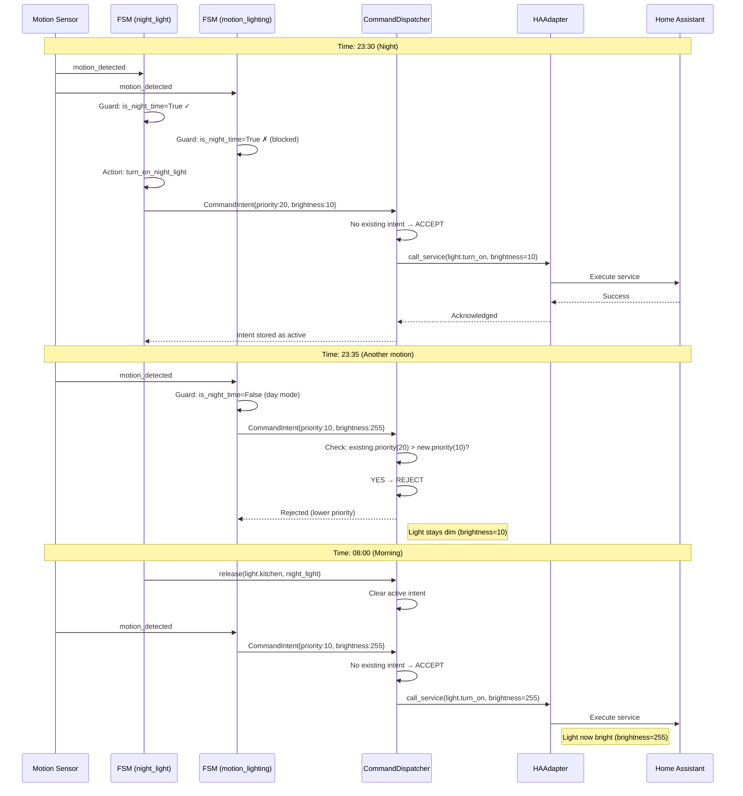

# Architecture Documentation

## System Overview

The Smart Home FSM Platform is a modular, event-driven automation system built around finite state machines. This document describes the core architectural components, their interactions, and design decisions.

## Composition & Conflict Resolution

### Behaviors Array Concept

In the Smart Home Platform, devices can have **multiple behaviors** that compete for control. This is achieved through the `behaviors` array in the manifest configuration.

**Example from `instances/leonids_house/manifest.yaml`:**

```yaml
devices:
- type: light_motion
  id: light.kitchen
  behaviors:
    - template: night_light
      priority: 20  # High priority for night light
      params:
        brightness: 10
        schedule: "23:00-07:00"
    - template: lighting
      priority: 10  # Standard priority for motion lighting
      params:
        motion_sensor: binary_sensor.kitchen_motion
        motion_timeout_sec: 300
        schedule: "07:00-23:00"
        brightness: 255
```

**Why Multiple Behaviors?**
- A single device (like `light.kitchen`) may need different automation logic at different times
- Night mode: dim light (brightness=10) when motion detected between 23:00-07:00
- Day mode: bright light (brightness=255) when motion detected between 07:00-23:00
- Each behavior is an independent FSM template with its own priority

### Priority System

Priorities determine which behavior wins when multiple behaviors want to control the same device:

| Priority | Behavior | Use Case |
|----------|----------|----------|
| 20+ | Critical/Safety | Emergency override, safety systems |
| 20 | Night Light | Night mode automation (dims other behaviors) |
| 10 | Motion Lighting | Standard motion-based automation |
| 1 | Climate/Ventilation | Background environmental control |

**Rules:**
1. **Higher priority wins**: If `night_light` (priority=20) is active, `motion_lighting` (priority=10) commands are ignored
2. **Equal priority replaces**: If two behaviors have the same priority, the latest one takes control
3. **Release mechanism**: Behaviors can explicitly release control, allowing lower-priority behaviors to take over

### CommandDispatcher Architecture

The `CommandDispatcher` is responsible for conflict resolution between FSM behaviors:

```python
class CommandDispatcher:
    async def submit(self, intent: CommandIntent) -> bool:
        """Submit command with priority-based conflict resolution."""
        
    def release(self, device_id: str, source: str) -> bool:
        """Release control of a device."""
```

**CommandIntent Structure:**
```python
@dataclass
class CommandIntent:
    device_id: str       # Target device (e.g., "light.kitchen")
    domain: str          # HA domain (e.g., "light")
    service: str         # Service to call (e.g., "turn_on")
    data: dict           # Service parameters (e.g., {"brightness": 10})
    priority: int        # Priority level (higher = more important)
    source: str          # Behavior name (e.g., "night_light")
```

### Command Flow Diagram

```
┌─────────────────────────────────────────────────────────────────────────┐
│                         SMART HOME PLATFORM                              │
└─────────────────────────────────────────────────────────────────────────┘

┌──────────────┐     ┌──────────────┐     ┌──────────────────────────────┐
│   FSM #1     │     │   FSM #2     │     │         FSM #N               │
│  (night_     │     │  (motion_    │     │   (other behaviors...)       │
│   light)     │     │   lighting)  │     │                              │
│  priority=20 │     │  priority=10 │     │                              │
└──────┬───────┘     └──────┬───────┘     └──────────────┬───────────────┘
       │                    │                            │
       │ CommandIntent      │ CommandIntent              │ CommandIntent
       │ {brightness: 10}   │ {brightness: 255}          │ {...}
       ▼                    ▼                            ▼
┌────────────────────────────────────────────────────────────────────────┐
│                        CommandDispatcher                                │
│  ┌──────────────────────────────────────────────────────────────────┐  │
│  │  Active Intents per Device:                                       │  │
│  │  - light.kitchen: {source: "night_light", priority: 20}          │  │
│  │                                                                   │  │
│  │  Conflict Resolution Logic:                                       │  │
│  │  1. If existing.priority > new.priority → REJECT                  │  │
│  │  2. If existing.priority <= new.priority → ACCEPT & REPLACE       │  │
│  └──────────────────────────────────────────────────────────────────┘  │
└────────────────────────────────────────────────────────────────────────┘
                                    │
                                    │ Accepted Command Only
                                    ▼
                          ┌──────────────────┐
                          │    HAAdapter     │
                          │  (calls service) │
                          └────────┬─────────┘
                                   │
                                   ▼
                          ┌──────────────────┐
                          │ Home Assistant   │
                          │  light.turn_on   │
                          └──────────────────┘
```

### Example Scenario: Night vs Motion

**Time: 23:30 (Night)**
1. Motion detected in kitchen
2. `night_light` FSM triggers (guard `is_night_time=True`)
3. Action returns `CommandIntent(priority=20, brightness=10)`
4. Dispatcher accepts (no existing intent or higher priority)
5. HA receives: `light.turn_on(brightness=10)`

**Time: 23:35 (Still Night)**
1. Another motion detected
2. `motion_lighting` FSM would trigger (if not for guard)
3. Even if it did, `CommandIntent(priority=10, brightness=255)` would be **rejected**
4. Dispatcher logs: `"Ignored motion_lighting (10) because night_light (20) is active"`
5. Light stays dim

**Time: 08:00 (Morning)**
1. `night_light` releases control (schedule ends)
2. Dispatcher clears active intent for `light.kitchen`
3. Motion detected
4. `motion_lighting` FSM triggers (guard `is_night_time=False`)
5. Action returns `CommandIntent(priority=10, brightness=255)`
6. Dispatcher accepts (no competing intent)
7. HA receives: `light.turn_on(brightness=255)`

### Mermaid Flow Diagram



## Core Components

### 1. HAAdapter (`src/smart_home/adapters/ha_adapter.py`)

**Purpose**: Bidirectional communication bridge between Home Assistant and the FSM platform.

**Responsibilities**:
- Receive state change events from HA entities
- Call HA services to control devices
- Generate and propagate `trace_id` for debugging
- Handle connection failures with exponential backoff (WebSocket mode)
- Provide graceful shutdown

**Modes of Operation**:

#### Pyscript Mode (Recommended)
```python
adapter = HAAdapter(mode="pyscript", engine=engine, hass=hass)
```

**Architecture**:
```
┌─────────────────┐     ┌──────────────┐     ┌─────────────┐
│ Home Assistant  │────▶│   Pyscript   │────▶│  HAAdapter  │
│   Entities      │     │   Runtime    │     │             │
└─────────────────┘     └──────────────┘     └─────────────┘
```

**Advantages**:
- Hot-reload in ~1 second
- Direct access to `hass.services.async_call`
- No external dependencies
- Runs inside HA process space

#### WebSocket Mode (Standalone)
```python
adapter = HAAdapter(
    mode="websocket",
    engine=engine,
    ws_url="ws://localhost:8123/api/websocket",
    token="your_token"
)
```

**Architecture**:
```
┌─────────────────┐     ┌──────────────┐     ┌─────────────┐
│ Home Assistant  │◀───▶│  WebSocket   │◀───▶│  HAAdapter  │
│   WebSocket API │     │   Client     │     │             │
└─────────────────┘     └──────────────┘     └─────────────┘
                               │
                        Exponential Backoff
                        (1s → 2s → 4s → ... → 60s max)
```

**Reconnection Strategy**:
- Initial delay: 1 second
- Multiplier: 2x per attempt
- Maximum delay: 60 seconds
- Reset on successful connection

### 2. EventBus (`src/smart_home/core/event_bus.py`)

**Purpose**: Pub/sub event distribution system.

**Interface**:
```python
class EventBus:
    def subscribe(event_type: str, handler: Callable) -> None
    def unsubscribe(event_type: str, handler: Callable) -> None
    async def publish(event_type: str, payload: Any, trace_id: str) -> None
```

**Flow**:
```
HAAdapter.on_state_change()
    │
    ├─ Generates trace_id (if not in context)
    │
    ▼
EventBus.publish("state_change", payload, trace_id)
    │
    ├─ Binds trace_id to logger
    │
    ▼
All subscribed handlers receive event
    │
    ├─ FSMEngine.trigger()
    ├─ Other subscribers...
```

**Trace ID Handling**:
- If `trace_id` not provided: generates short UUID (8 chars)
- Binds to loguru context: `logger.bind(trace_id=trace_id)`
- Passes to all handlers via keyword argument

### 3. FSMEngine (`src/smart_home/core/fsm.py`)

**Purpose**: Core state machine execution engine.

**Key Data Structures**:

```python
@dataclass(frozen=True)
class State:
    current_state: str
    entered_at: float
    context: dict[str, Any] = field(default_factory=dict)

@dataclass(frozen=True)
class Transition:
    from_state: str
    to_state: str
    trigger: str
    guard: Optional[Callable[..., bool]]
    action: Optional[Callable[..., Any]]
    timeout_sec: Optional[float]
```

**Trigger Flow**:
```
FSMEngine.trigger(entity_id, event, external_ctx, trace_id)
    │
    ├─ 1. Cancel existing timers (_cancel_timers)
    │     └─ Prevents duplicate timeouts
    │
    ├─ 2. Validate FSM definition exists
    │
    ├─ 3. Check debounce protection
    │     └─ Skip if elapsed < debounce_sec
    │
    ├─ 4. Find matching transitions
    │     └─ from_state == current AND trigger == event
    │
    ├─ 5. Merge contexts
    │     └─ merged = {**state.context, **external_ctx}
    │
    ├─ 6. For each transition:
    │     ├─ Evaluate guard (if present)
    │     ├─ Execute action (if present)
    │     ├─ Create new State with merged context
    │     ├─ Schedule timeout (if timeout_sec > 0)
    │     └─ Return True on success
    │
    └─ 7. Return False if no valid transition
```

**Timer Management**:

```python
async def _timeout_handler(entity_id: str, timeout_sec: float, trace_id: str) -> None:
    log = logger.bind(trace_id=trace_id)
    try:
        await asyncio.sleep(timeout_sec)
        log.debug(f"Entity {entity_id}: Timeout expired")
        await self.trigger(entity_id, "timeout", trace_id=trace_id)
    except asyncio.CancelledError:
        log.debug(f"Entity {entity_id}: Timeout cancelled")
        raise
```

**Critical Design Decision**: `_cancel_timers` is called at the **beginning** of every `trigger()` call. This ensures:
1. No stale timers fire after a new event
2. Rapid successive triggers don't accumulate timers
3. Timeout chains reset properly

### 4. Registry (`src/smart_home/core/registry.py`)

**Purpose**: Central registration for guard and action functions.

**Usage**:
```python
registry = StateRegistry()

# Register guard functions
registry.register_guard("is_night_time", is_night_time_fn)

# Register action functions
registry.register_action("turn_on_lights", turn_on_lights_fn)

# Retrieve by name
guard_fn = registry.get_guard("is_night_time")
action_fn = registry.get_action("turn_on_lights")
```

### 5. Scheduler (`src/smart_home/core/scheduler.py`)

**Purpose**: Timer management and delayed execution.

**Note**: In the current architecture, timer management is integrated into `FSMEngine` via `_timeout_handler`. The Scheduler module may be used for more complex scheduling scenarios in the future.

## Trace ID Propagation

### Complete Flow Example

```
User walks into kitchen
    │
    ▼
binary_sensor.kitchen_motion: off → on
    │
    ▼ [trace_id generated: a1b2c3d4]
HAAdapter.on_state_change(
    entity_id="binary_sensor.kitchen_motion",
    new_state="on",
    old_state="off",
    context={"trace_id": "a1b2c3d4"}
)
    │
    ▼ [log: trace_id=a1b2c3d4]
    │ "HAAdapter: state_change received for binary_sensor.kitchen_motion"
    │
EventBus.publish(
    event_type="state_change",
    payload={...},
    trace_id="a1b2c3d4"
)
    │
    ▼ [log: trace_id=a1b2c3d4]
    │ "EventBus: Publishing event: state_change"
    │
FSMEngine.trigger(
    entity_id="binary_sensor.kitchen_motion",
    event="motion_detected",
    external_ctx={"new_state": "on", "trace_id": "a1b2c3d4"},
    trace_id="a1b2c3d4"
)
    │
    ├─ [log: trace_id=a1b2c3d4]
    │  "FSM Engine: Entity binary_sensor.kitchen_motion: Transition 'idle' -> 'active'"
    │
    ├─ Execute action: turn_on_kitchen_light(ctx)
    │     │
    │     ▼
    │     HAAdapter.call_service(
    │         domain="light",
    │         service="turn_on",
    │         entity_id="light.kitchen",
    │         trace_id="a1b2c3d4"
    │     )
    │         │
    │         ▼ [log: trace_id=a1b2c3d4]
    │         │ "HAAdapter: calling service light.turn_on for light.kitchen"
    │         │
    │         hass.services.async_call(...)
    │             │
    │             ▼ [log: trace_id=a1b2c3d4]
    │             │ "HAAdapter: service light.turn_on called successfully"
    │
    └─ Schedule timeout (300s)
        │
        ▼ [5 minutes later, trace_id preserved]
        _timeout_handler(entity_id, 300, "a1b2c3d4")
            │
            ▼ [log: trace_id=a1b2c3d4]
            │ "Entity binary_sensor.kitchen_motion: Timeout expired"
            │
            FSMEngine.trigger(entity_id, "timeout", trace_id="a1b2c3d4")
```

### Log Output Example

Searching logs by `trace_id`:
```bash
grep "a1b2c3d4" home-assistant.log
```

Returns:
```
2024-01-15 10:30:00.123 [trace_id:a1b2c3d4] HAAdapter: state_change received for binary_sensor.kitchen_motion: 'off' -> 'on'
2024-01-15 10:30:00.125 [trace_id:a1b2c3d4] EventBus: Publishing event: state_change
2024-01-15 10:30:00.127 [trace_id:a1b2c3d4] FSM Engine: Entity binary_sensor.kitchen_motion: Transition 'idle' -> 'active' triggered by 'motion_detected'
2024-01-15 10:30:00.129 [trace_id:a1b2c3d4] HAAdapter: calling service light.turn_on for light.kitchen
2024-01-15 10:30:00.234 [trace_id:a1b2c3d4] HAAdapter: service light.turn_on called successfully
2024-01-15 10:35:00.130 [trace_id:a1b2c3d4] Entity binary_sensor.kitchen_motion: Timeout expired, triggering 'timeout' event
2024-01-15 10:35:00.132 [trace_id:a1b2c3d4] FSM Engine: Entity binary_sensor.kitchen_motion: Transition 'active' -> 'timeout_pending' triggered by 'timeout'
```

## Error Handling Strategy

### Service Call Failures

```python
async def call_service(...) -> bool:
    try:
        # Attempt service call
        return await self._call_service_pyscript(...)
    except Exception as e:
        log.error(f"HAAdapter: service call failed: {e}")
        return False  # Never raise!
```

**Design Principle**: Service call failures are logged but **never propagated**. This ensures:
1. FSM state remains consistent
2. One failing device doesn't break entire automation
3. Errors are visible in logs for debugging

### Guard Evaluation Failures

```python
def _evaluate_guard(self, guard, context, log) -> bool:
    try:
        result = guard(context)
        return result
    except Exception as e:
        log.error(f"Guard '{guard.__name__}' raised exception: {e}, denying transition")
        return False  # Deny transition on error
```

**Design Principle**: Guards fail **safe** (deny transition) on errors.

### Action Execution Failures

```python
async def _execute_action(self, action, context, log) -> None:
    try:
        result = action(context)
        if asyncio.iscoroutine(result):
            await result
    except Exception as e:
        log.error(f"Action '{action.__name__}' raised exception: {e}")
        # Continue anyway - action failure doesn't block state transition
```

**Design Principle**: Actions are **best-effort**. State transition occurs even if action fails.

## Context Management

### State Context

Each `State` object carries a `context` dictionary that persists across transitions:

```python
@dataclass(frozen=True)
class State:
    current_state: str
    entered_at: float
    context: dict[str, Any] = field(default_factory=dict)
```

### Context Merging

When a transition occurs:

```python
# Internal context from previous state
merged_context = {**current_state.context}

# External context from event (e.g., sensor data, trace_id)
if external_ctx:
    merged_context.update(external_ctx)

# New state receives merged context
new_state = State(
    current_state=transition.to_state,
    entered_at=now,
    context=merged_context
)
```

### Use Cases

#### Manual Override Detection

```python
# User manually turns on light
adapter.on_state_change(
    entity_id="switch.kitchen_light",
    new_state="on",
    old_state="off",
    context={"manual_override_at": time.time()}
)

# Guard function checks context
def no_manual_override(ctx: dict) -> bool:
    manual_at = ctx.get("manual_override_at", 0)
    if manual_at and (time.time() - manual_at) < 3600:
        return False  # Block auto-off for 1 hour
    return True
```

#### Location Tracking

```python
# Event includes location context
adapter.on_state_change(
    entity_id="binary_sensor.front_door",
    new_state="on",
    old_state="off",
    context={"location": "entrance", "zone": "ground_floor"}
)

# Action can use location
async def alert_user(ctx: dict) -> None:
    location = ctx.get("location", "unknown")
    await notify_message(f"Door opened at {location}")
```

## Graceful Shutdown

### Adapter Shutdown

```python
async def stop(self) -> None:
    # Signal all background tasks to stop
    self._shutdown_event.set()
    
    # Cancel reconnection task
    if self._reconnect_task:
        self._reconnect_task.cancel()
        try:
            await self._reconnect_task
        except asyncio.CancelledError:
            pass
    
    # Clean up WebSocket resources
    if self._mode == "websocket":
        await self._cleanup_websocket()
```

### Engine Shutdown

```python
async def shutdown(self) -> None:
    # Cancel all pending timers
    for entity_id in list(self._timers.keys()):
        await self._cancel_timers(entity_id)
    logger.info("FSM Engine shutdown complete")
```

### Pyscript Lifecycle Hooks

```python
def pyscript_startup() -> None:
    """Called when script loads."""
    init_smart_home()

async def pyscript_shutdown() -> None:
    """Called before script unloads."""
    await adapter.stop()
    await engine.shutdown()
```

## Testing Strategy

### Unit Tests

Test individual components in isolation:

```python
@pytest.mark.asyncio
async def test_fsm_transition():
    engine = FSMEngine()
    # Setup FSM
    # Trigger event
    # Assert state changed
```

### Integration Tests

Test component interactions:

```python
@pytest.mark.asyncio
async def test_ha_adapter_to_fsm():
    adapter = HAAdapter(mode="mock", engine=engine)
    await adapter.on_state_change("sensor_1", "on", "off", {})
    # Verify FSM received event
```

### End-to-End Tests

Complete scenarios with mocked HA:

```python
@pytest.mark.asyncio
@freeze_time("2024-01-15 10:30:00")
async def test_full_day_scenario():
    # Simulate full day of events
    # Verify correct behavior at each step
```

### Time-Based Tests with Freezegun

```python
from freezegun import freeze_time

@pytest.mark.asyncio
@freeze_time("2024-01-15 10:30:00")
async def test_timeout_after_5_minutes():
    engine = FSMEngine()
    await engine.trigger("sensor_1", "motion_detected")
    
    # Fast-forward 5 minutes
    with freeze_time("2024-01-15 10:35:00"):
        state = engine.get_state("sensor_1")
        assert state.current_state == "timeout_pending"
```

## Performance Considerations

### Async-First Design

All I/O operations are async:
- `async def on_state_change(...)`
- `async def call_service(...)`
- `async def trigger(...)`

This ensures:
- Non-blocking event processing
- Scalability to many concurrent events
- Compatibility with HA's async architecture

### Immutable State

`State` and `Transition` are frozen dataclasses:
- Thread-safe by design
- Predictable behavior
- Easy to reason about

### Minimal Dependencies

Core dependencies:
- `loguru`: Logging
- `pydantic`: Schema validation (optional, for YAML loading)
- `pyyaml`: YAML parsing
- `aiohttp`: WebSocket mode only

## Future Extensions

### Potential Enhancements

1. **Distributed FSM**: Multiple engines coordinating across locations
2. **Visual Editor**: Web-based FSM designer
3. **Metrics Export**: Prometheus/Grafana integration
4. **Rule Engine**: Complex event processing (CEP) layer
5. **Machine Learning**: Anomaly detection in state transitions

### Plugin Architecture

Future version may support:
```python
class FSMPlugin:
    async def on_init(self, engine: FSMEngine) -> None
    async def on_event(self, event: Event) -> None
    async def on_shutdown(self) -> None
```

## Conclusion

The Smart Home FSM Platform provides a robust, debuggable foundation for home automation. Key architectural decisions:

1. **Immutable state** for predictability
2. **Async-first** for performance
3. **Trace IDs** for debuggability
4. **Error isolation** for reliability
5. **Context propagation** for flexibility

These principles ensure the platform scales from simple automations to complex, house-wide systems while remaining maintainable and debuggable.
